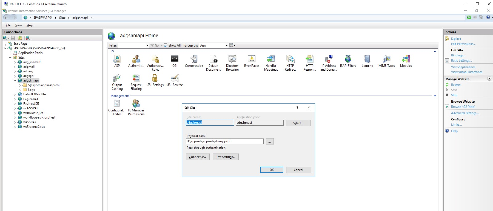

# API Produccion Interface

---

## Informacion del Proyecto

<table>
<tr>
<td width="50%" align="center">


**Cliente**

**Complejo Hospitalario San Pablo**

</td>
<td width="50%" align="center">


**Desarrollado por**

**ADG Systems**

</td>
</tr>
</table>

| Atributo | Valor |
|----------|-------|
| **Proyecto** | Gestion de Honorarios Medicos |
| **Modulo** | API Interface de Produccion |
| **Cliente** | Complejo Hospitalario San Pablo |
| **Desarrollador** | ADG Systems |
| **Version** | 3.0 |

---

## Descripcion General

API para el registro masivo de producciones medicas y actualizacion de liquidaciones a traves de una interfaz de integracion. Permite crear multiples registros de produccion y actualizar datos de liquidacion en una sola llamada, procesando cada registro de forma individual y retornando el detalle de estado por cada registro recibido.

---

## Instalacion y Despliegue

### Informacion del Servidor

| Atributo | Valor |
|----------|-------|
| **Servidor** | 192.1.0.173 |
| **URL Local** | http://localhost:92 |
| **URL Swagger** | http://localhost:92/swagger |
| **Carpeta Fisica** | D:\appweb\shmappapi |
| **Plataforma** | IIS (Internet Information Services) |

### Configuracion en IIS



### Swagger UI

Para probar los endpoints de forma interactiva, acceda a la interfaz de Swagger:

**URL:** `http://localhost:92/swagger`


### Estructura de Carpetas

```
D:\appweb\shmappapi\
├── appsettings.json
├── appsettings.Production.json
├── SHM.AppApiHonorarioMedico.dll
├── SHM.AppApiHonorarioMedico.exe
├── web.config
└── ...
```

### Verificacion de Instalacion

Para verificar que el API esta funcionando correctamente:

1. Abra un navegador web
2. Acceda a: `http://localhost:92/api/ProduccionInterface/test`
3. Deberia recibir una respuesta como:

```json
{
  "status": "OK",
  "message": "API activa",
  "serverDateTime": "2026-01-31T10:30:00",
  "serverDateTimeUtc": "2026-01-31T15:30:00Z"
}
```

### Health Check (Monitoreo de Salud)

El API incluye un endpoint de **Health Check** para monitorear el estado de la aplicacion y sus dependencias (base de datos Oracle).

**URL:** `http://localhost:92/health`

**Response (Healthy):**
```json
{
  "status": "Healthy",
  "totalDuration": "125.45 ms",
  "timestamp": "2026-01-31T10:30:00",
  "checks": [
    {
      "name": "oracle-database",
      "status": "Healthy",
      "description": null,
      "duration": "120.32 ms"
    }
  ]
}
```

**Response (Unhealthy):**
```json
{
  "status": "Unhealthy",
  "totalDuration": "5023.12 ms",
  "timestamp": "2026-01-31T10:30:00",
  "checks": [
    {
      "name": "oracle-database",
      "status": "Unhealthy",
      "description": "Error de conexion a Oracle",
      "duration": "5000.00 ms"
    }
  ]
}
```

| Estado | Descripcion |
|--------|-------------|
| **Healthy** | Todos los servicios funcionan correctamente |
| **Degraded** | Algunos servicios tienen problemas pero el API sigue operativo |
| **Unhealthy** | Servicios criticos no disponibles |

### Logs (NLog)

El API utiliza **NLog** para el registro de eventos y errores. Los logs se generan diariamente en la carpeta `/Log`.

| Atributo | Valor |
|----------|-------|
| **Carpeta** | D:\appweb\shmappapi\Log |
| **Formato archivo** | Log_yyyyMMdd.txt |
| **Ejemplo** | Log_20260131.txt |
| **Rotacion** | Diaria (un archivo por dia) |

**Estructura de carpeta:**
```
D:\appweb\shmappapi\
├── Log\
│   ├── Log_20260129.txt
│   ├── Log_20260130.txt
│   └── Log_20260131.txt
├── appsettings.json
└── ...
```

**Ejemplo de contenido del log:**
```
2026-02-08 10:30:15.123 |INFO| Inicio de creacion masiva de producciones mediante interface
2026-02-08 10:30:15.456 |INFO| Producciones procesadas: 10, Creados: 7, Obviados: 2, Errores: 1
2026-02-08 10:35:22.789 |INFO| Inicio de actualizacion masiva de liquidaciones mediante interface
2026-02-08 10:35:22.890 |INFO| Liquidaciones procesadas: 5, Actualizados: 4, Obviados: 1, Errores: 0
2026-02-08 10:40:33.012 |ERROR| Error al crear producciones mediante interface - ORA-12541: TNS:no listener
```

**Niveles de log:**

| Nivel | Descripcion |
|-------|-------------|
| **DEBUG** | Informacion detallada para depuracion |
| **INFO** | Eventos normales de operacion |
| **WARN** | Advertencias (errores de validacion) |
| **ERROR** | Errores de sistema o excepciones |

---

## Endpoints Disponibles

| Metodo | URL | Descripcion |
|--------|-----|-------------|
| GET | `/health` | Health Check - Estado del API y BD |
| GET | `/api/ProduccionInterface/test` | Prueba de conexion |
| POST | `/api/ProduccionInterface/producciones` | Crear producciones |
| POST | `/api/ProduccionInterface/liquidaciones` | Actualizar liquidaciones |

---

## Formato de Respuesta Estandarizado

Todos los endpoints devuelven una respuesta con la siguiente estructura:

```json
{
  "isSuccess": true,
  "message": "Correcto.",
  "data": {
    "cantidadCreados": 0,
    "cantidadObviados": 0,
    "cantidadErrores": 0,
    "totalProcesados": 0,
    "detalle": [
      {
        "codigoSede": "string",
        "codigoEntidad": "string",
        "codigoProduccion": "string",
        "tipoEntidadMedica": "string",
        "estado": "OK",
        "mensaje": "string"
      }
    ]
  },
  "errors": []
}
```

### Campos del Envelope

| Campo | Tipo | Descripcion |
|-------|------|-------------|
| `isSuccess` | boolean | Indica si la operacion fue exitosa |
| `message` | string | Mensaje descriptivo del resultado |
| `data` | object | Datos de la respuesta (ver estructura abajo) |
| `errors` | array | Lista de errores si los hubiera |

### Campos de `data` (InterfaceProduccionResultDto)

| Campo | Tipo | Descripcion |
|-------|------|-------------|
| `cantidadCreados` | int | Cantidad de registros creados/actualizados exitosamente |
| `cantidadObviados` | int | Cantidad de registros omitidos (duplicados o no encontrados) |
| `cantidadErrores` | int | Cantidad de registros con error |
| `totalProcesados` | int | Total de registros procesados (creados + obviados + errores) |
| `detalle` | array | Lista con el estado de proceso de cada registro recibido |

### Campos de cada elemento en `detalle` (InterfaceProduccionDetalleDto)

| Campo | Tipo | Descripcion |
|-------|------|-------------|
| `codigoSede` | string | Codigo de sede del registro procesado |
| `codigoEntidad` | string | Codigo de entidad del registro procesado |
| `codigoProduccion` | string | Codigo de produccion del registro procesado |
| `tipoEntidadMedica` | string/null | Tipo de entidad medica (puede ser null en producciones) |
| `estado` | string | Estado del proceso: `OK` (Correcto) o `ER` (Error) |
| `mensaje` | string/null | Mensaje descriptivo. Si hay error, muestra el detalle del error |

---

## 1. Test de Conexion

### Informacion del Endpoint

| Atributo | Valor |
|----------|-------|
| **URL** | `GET /api/ProduccionInterface/test` |
| **Metodo HTTP** | GET |
| **Autenticacion** | No requerida |

### Response (HTTP 200 OK)

```json
{
  "status": "OK",
  "message": "API activa",
  "serverDateTime": "2026-01-31T10:30:00",
  "serverDateTimeUtc": "2026-01-31T15:30:00Z"
}
```

---

## 2. Crear Producciones

### Informacion del Endpoint

| Atributo | Valor |
|----------|-------|
| **URL** | `POST /api/ProduccionInterface/producciones` |
| **Metodo HTTP** | POST |
| **Content-Type** | application/json |
| **Autenticacion** | No requerida (version actual) |

### Estructura del Body

El endpoint recibe un **array JSON** de objetos con la siguiente estructura:

```json
[
  {
    "codigoSede": "string",
    "codigoEntidad": "string",
    "codigoProduccion": "string",
    "numeroProduccion": "string",
    "tipoProduccion": "string",
    "tipoEntidadMedica": "string",
    "tipoMedico": "string",
    "tipoRubro": "string",
    "descripcion": "string",
    "periodo": "string",
    "fechaProduccion": "string",
    "estadoProduccion": "string",
    "mtoConsumo": 0.00,
    "mtoDescuento": 0.00,
    "mtoSubtotal": 0.00,
    "mtoRenta": 0.00,
    "mtoIgv": 0.00,
    "mtoTotal": 0.00
  }
]
```

### Descripcion de Campos

| Campo | Tipo | Obligatorio | Descripcion |
|-------|------|-------------|-------------|
| `codigoSede` | string | Si | Codigo de la sede. Se utiliza para obtener el IdSede interno. |
| `codigoEntidad` | string | Si | Codigo de la entidad medica. Se utiliza para obtener el IdEntidadMedica interno. |
| `codigoProduccion` | string | Si | Codigo unico de la produccion. |
| `numeroProduccion` | string | Si | Numero de la produccion. |
| `tipoProduccion` | string | Si | Tipo de produccion (ej: "CONS", "PROC"). |
| `tipoEntidadMedica` | string | Si | Tipo de entidad medica (ej: "MEDICO", "CLINICA"). |
| `tipoMedico` | string | Si | Tipo de medico (ej: "IN", "EX"). |
| `tipoRubro` | string | Si | Tipo de rubro. |
| `descripcion` | string | Si | Descripcion de la produccion. |
| `periodo` | string | Si | Periodo de la produccion en formato `dd/MM/yyyy` (ej: "12/01/2026"). |
| `fechaProduccion` | string | Si | Fecha de produccion en formato `dd/MM/yyyy HH:mm:ss` (ej: "31/01/2026 14:30:00"). |
| `estadoProduccion` | string | Si | Estado de la produccion (ej: "ACTIVO", "PENDIENTE"). |
| `mtoConsumo` | decimal | Si | Monto de consumo. |
| `mtoDescuento` | decimal | Si | Monto de descuento. |
| `mtoSubtotal` | decimal | Si | Monto subtotal. |
| `mtoRenta` | decimal | Si | Monto de renta. |
| `mtoIgv` | decimal | Si | Monto de IGV. |
| `mtoTotal` | decimal | Si | Monto total. |

### Llave Unica (Producciones)

La combinacion de los siguientes campos forma la **llave unica** para identificar registros duplicados:

- `codigoSede` (convertido a IdSede)
- `codigoEntidad` (convertido a IdEntidadMedica)
- `codigoProduccion`
- `numeroProduccion`
- `tipoEntidadMedica`

Si un registro con esta llave ya existe en la base de datos, sera **omitido** (no se creara duplicado).

### Respuesta Exitosa (HTTP 201 Created)

```json
{
  "isSuccess": true,
  "message": "Correcto.",
  "data": {
    "cantidadCreados": 8,
    "cantidadObviados": 1,
    "cantidadErrores": 1,
    "totalProcesados": 10,
    "detalle": [
      {
        "codigoSede": "01",
        "codigoEntidad": "0994",
        "codigoProduccion": "20251017",
        "tipoEntidadMedica": null,
        "estado": "OK",
        "mensaje": "Creado"
      },
      {
        "codigoSede": "01",
        "codigoEntidad": "0994",
        "codigoProduccion": "20251018",
        "tipoEntidadMedica": null,
        "estado": "OK",
        "mensaje": "Ya existe, omitido"
      },
      {
        "codigoSede": "XX",
        "codigoEntidad": "0994",
        "codigoProduccion": "20251019",
        "tipoEntidadMedica": null,
        "estado": "ER",
        "mensaje": "Sede con codigo 'XX' no encontrada"
      }
    ]
  },
  "errors": []
}
```

> **Nota:** El campo `estado` indica el resultado del proceso por cada registro:
> - `OK`: Registro creado exitosamente o ya existia (omitido).
> - `ER`: Error al procesar el registro. El campo `mensaje` contiene el detalle del error.

### Respuesta de Error - Validacion (HTTP 400 Bad Request)

**Coleccion vacia:**
```json
{
  "isSuccess": false,
  "message": "Error de validacion.",
  "data": null,
  "errors": ["La coleccion de producciones no puede estar vacia"]
}
```

**Validacion de campos obligatorios:**
```json
{
  "isSuccess": false,
  "message": "Error de validacion.",
  "data": null,
  "errors": [
    "The CodigoSede field is required.",
    "The TipoEntidadMedica field is required."
  ]
}
```

> **Nota:** Los errores de sede no encontrada, entidad no encontrada o formato de fecha invalido ya no devuelven HTTP 400. Estos errores ahora se reportan por registro dentro del campo `detalle` con `estado: "ER"`.

### Respuesta de Error - Servidor (HTTP 500 Internal Server Error)

```json
{
  "isSuccess": false,
  "message": "Error interno del servidor.",
  "data": null,
  "errors": ["Detalle del error"]
}
```

---

## 3. Actualizar Liquidaciones

### Informacion del Endpoint

| Atributo | Valor |
|----------|-------|
| **URL** | `POST /api/ProduccionInterface/liquidaciones` |
| **Metodo HTTP** | POST |
| **Content-Type** | application/json |
| **Autenticacion** | No requerida (version actual) |

### Estructura del Body

El endpoint recibe un **array JSON** de objetos con la siguiente estructura:

```json
[
  {
    "codigoSede": "string",
    "codigoEntidad": "string",
    "codigoProduccion": "string",
    "numeroProduccion": "string",
    "tipoEntidadMedica": "string",
    "numeroLiquidacion": "string",
    "codigoLiquidacion": "string",
    "periodoLiquidacion": "string",
    "estadoLiquidacion": "string",
    "fechaLiquidacion": "string",
    "descripcionLiquidacion": "string"
  }
]
```

### Descripcion de Campos

| Campo | Tipo | Obligatorio | Descripcion |
|-------|------|-------------|-------------|
| `codigoSede` | string | Si | Codigo de la sede (llave para busqueda). |
| `codigoEntidad` | string | Si | Codigo de la entidad medica (llave para busqueda). |
| `codigoProduccion` | string | Si | Codigo de la produccion (llave para busqueda). |
| `numeroProduccion` | string | Si | Numero de la produccion (llave para busqueda). |
| `tipoEntidadMedica` | string | Si | Tipo de entidad medica (llave para busqueda). |
| `numeroLiquidacion` | string | Si | Numero de liquidacion a registrar. |
| `codigoLiquidacion` | string | Si | Codigo de liquidacion a registrar. |
| `periodoLiquidacion` | string | Si | Periodo de liquidacion (ej: "202601"). |
| `estadoLiquidacion` | string | Si | Estado de la liquidacion (ej: "PROCESADO", "PENDIENTE"). |
| `fechaLiquidacion` | string | Si | Fecha de liquidacion en formato `dd/MM/yyyy HH:mm:ss`. |
| `descripcionLiquidacion` | string | Si | Descripcion de la liquidacion. |

### Llave de Busqueda (Liquidaciones)

La combinacion de los siguientes campos se usa para **localizar** la produccion a actualizar:

- `codigoSede` (convertido a IdSede)
- `codigoEntidad` (convertido a IdEntidadMedica)
- `codigoProduccion`
- `numeroProduccion`
- `tipoEntidadMedica`

Si la produccion **no existe**, el registro sera **omitido** (cantidadObviados).

### Respuesta Exitosa (HTTP 200 OK)

```json
{
  "isSuccess": true,
  "message": "Correcto.",
  "data": {
    "cantidadCreados": 4,
    "cantidadObviados": 1,
    "cantidadErrores": 1,
    "totalProcesados": 6,
    "detalle": [
      {
        "codigoSede": "01",
        "codigoEntidad": "0994",
        "codigoProduccion": "20251017",
        "tipoEntidadMedica": "1",
        "estado": "OK",
        "mensaje": "Actualizado"
      },
      {
        "codigoSede": "01",
        "codigoEntidad": "0994",
        "codigoProduccion": "NO_EXISTE",
        "tipoEntidadMedica": "1",
        "estado": "OK",
        "mensaje": "Produccion no encontrada, omitido"
      },
      {
        "codigoSede": "01",
        "codigoEntidad": "0994",
        "codigoProduccion": "20251020",
        "tipoEntidadMedica": "1",
        "estado": "ER",
        "mensaje": "Formato de fecha invalido para FechaLiquidacion: '2026-01-31'. Use formato dd/MM/yyyy HH:mm:ss"
      }
    ]
  },
  "errors": []
}
```

> **Nota:** En este endpoint, `cantidadCreados` representa la cantidad de registros **actualizados** exitosamente.

### Respuesta de Error - Validacion (HTTP 400 Bad Request)

**Coleccion vacia:**
```json
{
  "isSuccess": false,
  "message": "Error de validacion.",
  "data": null,
  "errors": ["La coleccion de liquidaciones no puede estar vacia"]
}
```

> **Nota:** Los errores de sede no encontrada, produccion no encontrada o formato de fecha invalido ya no devuelven HTTP 400. Estos errores ahora se reportan por registro dentro del campo `detalle` con `estado: "ER"` (o `"OK"` con mensaje "omitido" en caso de produccion no encontrada).

---

## Comportamiento de Procesamiento

Ambos endpoints procesan cada registro de forma **individual**, capturando el resultado de cada operacion:

1. **Procesamiento por registro**: Cada registro se valida y procesa de forma independiente.
   - Se busca el `IdSede` por `CodigoSede`
   - Se busca el `IdEntidadMedica` por `CodigoEntidad`
   - Se parsean las fechas con el formato requerido
   - Se verifica existencia por llave compuesta
   - Si un registro falla, **no afecta a los demas registros**

2. **Detalle de estado por registro**: Cada registro procesado genera una entrada en el array `detalle` con:
   - `estado: "OK"` → Registro creado/actualizado exitosamente, o registro omitido (duplicado/no encontrado)
   - `estado: "ER"` → Error al procesar el registro (sede no encontrada, entidad no encontrada, formato de fecha invalido, etc.)

3. **Contadores de resumen**:
   - `cantidadCreados`: Registros creados (producciones) o actualizados (liquidaciones) exitosamente
   - `cantidadObviados`: Registros omitidos (ya existen en producciones, o no encontrados en liquidaciones)
   - `cantidadErrores`: Registros con error de validacion o procesamiento
   - `totalProcesados`: Suma total (creados + obviados + errores)

### Diagrama de Flujo

```
┌─────────────────────────────────────────────────────────────┐
│                    Recibe Coleccion                         │
└─────────────────────────────────────────────────────────────┘
                              │
                              ▼
              ┌───────────────┴───────────────┐
              │ ¿Coleccion vacia?             │
              └───────────────┬───────────────┘
                    Si │             │ No
                       ▼             ▼
              ┌─────────────┐ ┌─────────────────────────────────────────┐
              │ HTTP 400    │ │    PROCESAMIENTO POR REGISTRO           │
              │ Bad Request │ │  ┌─────────────────────────────────────┐ │
              └─────────────┘ │  │ Para cada registro:                 │ │
                              │  │   try {                             │ │
                              │  │     • Buscar IdSede por CodigoSede  │ │
                              │  │     • Buscar IdEntidad por Codigo   │ │
                              │  │     • Parsear fechas                │ │
                              │  │     • Verificar llave compuesta     │ │
                              │  │       - Existe → OK (omitido)       │ │
                              │  │       - No existe → Crear/Actualizar│ │
                              │  │     • Detalle: estado=OK            │ │
                              │  │   } catch {                         │ │
                              │  │     • Detalle: estado=ER, mensaje   │ │
                              │  │   }                                 │ │
                              │  └─────────────────────────────────────┘ │
                              └─────────────────────────────────────────┘
                                            │
                                            ▼
                              ┌─────────────────────────────────────────┐
                              │    HTTP 201/200 - Respuesta             │
                              │  {                                      │
                              │    "isSuccess": true,                   │
                              │    "data": {                            │
                              │      "cantidadCreados": N,              │
                              │      "cantidadObviados": M,             │
                              │      "cantidadErrores": E,              │
                              │      "totalProcesados": N+M+E,          │
                              │      "detalle": [                       │
                              │        { estado: "OK", mensaje: "..." },│
                              │        { estado: "ER", mensaje: "..." } │
                              │      ]                                  │
                              │    }                                    │
                              │  }                                      │
                              └─────────────────────────────────────────┘
```

---

## Ejemplos de Uso

### Ejemplo 1: Crear Producciones

**Request:**
```http
POST /api/ProduccionInterface/producciones HTTP/1.1
Host: localhost:5001
Content-Type: application/json

[
  {
    "codigoSede": "01",
    "codigoEntidad": "0994",
    "codigoProduccion": "20251017",
    "numeroProduccion": "20251039",
    "tipoProduccion": "02",
    "tipoEntidadMedica": "1",
    "tipoMedico": "02",
    "tipoRubro": "03",
    "descripcion": "SEGUNDA SEMANA DE OCTUBRE 2025",
    "periodo": "09/10/2025",
    "fechaProduccion": "09/10/2025 10:30:00",
    "estadoProduccion": "ACTIVO",
    "mtoConsumo": 1368.46,
    "mtoDescuento": 794.23,
    "mtoSubtotal": 574.23,
    "mtoRenta": 0,
    "mtoIgv": 103.36,
    "mtoTotal": 677.59
  },
  {
    "codigoSede": "01",
    "codigoEntidad": "0995",
    "codigoProduccion": "20251055",
    "numeroProduccion": "20251055",
    "tipoProduccion": "01",
    "tipoEntidadMedica": "1",
    "tipoMedico": "02",
    "tipoRubro": "03",
    "descripcion": "OCTUBRE 2025",
    "periodo": "10/10/2025",
    "fechaProduccion": "10/10/2025 14:00:00",
    "estadoProduccion": "ACTIVO",
    "mtoConsumo": 200,
    "mtoDescuento": 0,
    "mtoSubtotal": 200,
    "mtoRenta": 16,
    "mtoIgv": 0,
    "mtoTotal": 184
  }
]
```

**Response (201 Created):**
```json
{
  "isSuccess": true,
  "message": "Correcto.",
  "data": {
    "cantidadCreados": 2,
    "cantidadObviados": 0,
    "cantidadErrores": 0,
    "totalProcesados": 2,
    "detalle": [
      {
        "codigoSede": "01",
        "codigoEntidad": "0994",
        "codigoProduccion": "20251017",
        "tipoEntidadMedica": null,
        "estado": "OK",
        "mensaje": "Creado"
      },
      {
        "codigoSede": "01",
        "codigoEntidad": "0995",
        "codigoProduccion": "20251055",
        "tipoEntidadMedica": null,
        "estado": "OK",
        "mensaje": "Creado"
      }
    ]
  },
  "errors": []
}
```

### Ejemplo 2: Envio de Liquidaciones

**Request:**
```http
POST /api/ProduccionInterface/liquidaciones HTTP/1.1
Host: localhost:5001
Content-Type: application/json

[
  {
    "codigoSede": "01",
    "codigoEntidad": "0994",
    "codigoProduccion": "20251017",
    "numeroProduccion": "20251039",
    "tipoEntidadMedica": "1",
    "numeroLiquidacion": "20251017",
    "codigoLiquidacion": "20251017",
    "periodoLiquidacion": "10/10/2025",
    "estadoLiquidacion": "AUTORIZADO",
    "fechaLiquidacion": "31/01/2026 18:00:00",
    "descripcionLiquidacion": "CREDITO / 3RA SEMANA DICIEMBRE 2025, PROD:20251227"
  }
]
```

**Response (200 OK):**
```json
{
  "isSuccess": true,
  "message": "Correcto.",
  "data": {
    "cantidadCreados": 1,
    "cantidadObviados": 0,
    "cantidadErrores": 0,
    "totalProcesados": 1,
    "detalle": [
      {
        "codigoSede": "01",
        "codigoEntidad": "0994",
        "codigoProduccion": "20251017",
        "tipoEntidadMedica": "1",
        "estado": "OK",
        "mensaje": "Actualizado"
      }
    ]
  },
  "errors": []
}
```

### Ejemplo 3: Crear Producciones con cURL

```bash
curl -X POST "http://localhost:92/api/ProduccionInterface/producciones" \
  -H "Content-Type: application/json" \
  -d '[
    {
      "codigoSede": "001",
      "codigoEntidad": "ENT001",
      "codigoProduccion": "PROD2026001",
      "numeroProduccion": "0001",
      "tipoProduccion": "HONORARIO",
      "tipoEntidadMedica": "MEDICO",
      "tipoMedico": "STAFF",
      "tipoRubro": "CONSULTA",
      "descripcion": "Consulta ambulatoria cardiologia",
      "periodo": "202601",
      "fechaProduccion": "15/01/2026 09:00:00",
      "estadoProduccion": "PROCESADO",
      "mtoConsumo": 200.00,
      "mtoDescuento": 0.00,
      "mtoSubtotal": 200.00,
      "mtoRenta": 20.00,
      "mtoIgv": 36.00,
      "mtoTotal": 216.00
    }
  ]'
```

### Ejemplo 4: Actualizar Liquidaciones con cURL

```bash
curl -X POST "http://localhost:92/api/ProduccionInterface/liquidaciones" \
  -H "Content-Type: application/json" \
  -d '[
    {
      "codigoSede": "001",
      "codigoEntidad": "ENT001",
      "codigoProduccion": "PROD2026001",
      "numeroProduccion": "0001",
      "tipoEntidadMedica": "MEDICO",
      "numeroLiquidacion": "LIQ-2026-00001",
      "codigoLiquidacion": "LQ001",
      "periodoLiquidacion": "202601",
      "estadoLiquidacion": "LIQUIDADO",
      "fechaLiquidacion": "31/01/2026 23:59:59",
      "descripcionLiquidacion": "Liquidacion mensual enero 2026 - Cardiologia"
    }
  ]'
```

### Ejemplo 5: Producciones con Registros Duplicados

Cuando se envian registros que ya existen en la base de datos:

**Request:**
```json
[
  { "codigoSede": "001", "codigoEntidad": "ENT001", "codigoProduccion": "PROD001", "numeroProduccion": "001", "tipoEntidadMedica": "MEDICO", ... },
  { "codigoSede": "001", "codigoEntidad": "ENT001", "codigoProduccion": "PROD002", "numeroProduccion": "001", "tipoEntidadMedica": "MEDICO", ... },
  { "codigoSede": "001", "codigoEntidad": "ENT001", "codigoProduccion": "PROD003", "numeroProduccion": "001", "tipoEntidadMedica": "MEDICO", ... }
]
```

**Response (201 Created):** *(si PROD001 y PROD002 ya existian)*
```json
{
  "isSuccess": true,
  "message": "Correcto.",
  "data": {
    "cantidadCreados": 1,
    "cantidadObviados": 2,
    "cantidadErrores": 0,
    "totalProcesados": 3,
    "detalle": [
      {
        "codigoSede": "001",
        "codigoEntidad": "ENT001",
        "codigoProduccion": "PROD001",
        "tipoEntidadMedica": null,
        "estado": "OK",
        "mensaje": "Ya existe, omitido"
      },
      {
        "codigoSede": "001",
        "codigoEntidad": "ENT001",
        "codigoProduccion": "PROD002",
        "tipoEntidadMedica": null,
        "estado": "OK",
        "mensaje": "Ya existe, omitido"
      },
      {
        "codigoSede": "001",
        "codigoEntidad": "ENT001",
        "codigoProduccion": "PROD003",
        "tipoEntidadMedica": null,
        "estado": "OK",
        "mensaje": "Creado"
      }
    ]
  },
  "errors": []
}
```

### Ejemplo 6: Producciones con Errores por Registro

Cuando algunos registros tienen sede invalida u otros errores de validacion, se procesan individualmente sin afectar al resto:

**Request:**
```json
[
  { "codigoSede": "SEDE_INVALIDA", "codigoEntidad": "ENT001", "codigoProduccion": "PROD001", ... },
  { "codigoSede": "001", "codigoEntidad": "ENT001", "codigoProduccion": "PROD002", ... }
]
```

**Response (201 Created):**
```json
{
  "isSuccess": true,
  "message": "Correcto.",
  "data": {
    "cantidadCreados": 1,
    "cantidadObviados": 0,
    "cantidadErrores": 1,
    "totalProcesados": 2,
    "detalle": [
      {
        "codigoSede": "SEDE_INVALIDA",
        "codigoEntidad": "ENT001",
        "codigoProduccion": "PROD001",
        "tipoEntidadMedica": null,
        "estado": "ER",
        "mensaje": "Sede con codigo 'SEDE_INVALIDA' no encontrada"
      },
      {
        "codigoSede": "001",
        "codigoEntidad": "ENT001",
        "codigoProduccion": "PROD002",
        "tipoEntidadMedica": null,
        "estado": "OK",
        "mensaje": "Creado"
      }
    ]
  },
  "errors": []
}
```

### Ejemplo 7: Liquidaciones con Produccion No Encontrada

Cuando se intenta actualizar liquidacion de una produccion que no existe:

**Request:**
```json
[
  {
    "codigoSede": "001",
    "codigoEntidad": "ENT001",
    "codigoProduccion": "PROD_NO_EXISTE",
    "numeroProduccion": "001",
    "tipoEntidadMedica": "MEDICO",
    "numeroLiquidacion": "LIQ001",
    ...
  }
]
```

**Response (200 OK):** *(el registro se omite, no genera error)*
```json
{
  "isSuccess": true,
  "message": "Correcto.",
  "data": {
    "cantidadCreados": 0,
    "cantidadObviados": 1,
    "cantidadErrores": 0,
    "totalProcesados": 1,
    "detalle": [
      {
        "codigoSede": "001",
        "codigoEntidad": "ENT001",
        "codigoProduccion": "PROD_NO_EXISTE",
        "tipoEntidadMedica": "MEDICO",
        "estado": "OK",
        "mensaje": "Produccion no encontrada, omitido"
      }
    ]
  },
  "errors": []
}
```

---

## Codigos de Estado HTTP

| Codigo | Descripcion |
|--------|-------------|
| **200 OK** | Operacion exitosa (liquidaciones). |
| **201 Created** | Operacion exitosa (producciones). |
| **400 Bad Request** | Error de validacion: campos faltantes o coleccion vacia. Nota: errores de sede/entidad no encontrada o formato de fecha ahora se reportan por registro en `detalle`. |
| **500 Internal Server Error** | Error interno del servidor. |

---

## Consideraciones Importantes

1. **Idempotencia**: El API de producciones es seguro para reintentos. Si se envia la misma coleccion multiples veces, los registros duplicados seran omitidos automaticamente.

2. **Procesamiento individual**: Cada registro se procesa de forma independiente. Si un registro falla, los demas continuan procesandose normalmente. El detalle de cada registro se reporta en el array `detalle`.

3. **Detalle de estado**: La respuesta siempre incluye un array `detalle` con el estado (`OK` o `ER`) de cada registro procesado, junto con un mensaje descriptivo.

4. **Formato de fechas**: Las fechas deben enviarse en formato `dd/MM/yyyy HH:mm:ss` (ej: "31/01/2026 14:30:00").

5. **Rendimiento**: Para grandes volumenes de datos, considere enviar lotes de maximo 1000 registros por llamada.

6. **Errores por registro**: Los errores de validacion (sede no encontrada, entidad no encontrada, formato de fecha invalido) se reportan por registro en el campo `detalle` con `estado: "ER"`, sin afectar al resto de los registros.

---

## Informacion Tecnica

| Atributo | Valor |
|----------|-------|
| **Autor** | ADG Antonio |
| **Fecha de Creacion** | 2026-01-19 |
| **Version** | 3.0 |
| **Proyecto** | SHM.AppApiHonorarioMedico |

---

## Changelog

| Version | Fecha | Descripcion |
|---------|-------|-------------|
| 1.0 | 2026-01-19 | Version inicial del API |
| 2.0 | 2026-01-31 | - Nueva ruta `/producciones` para crear producciones |
|     |            | - Nuevo endpoint `/liquidaciones` para actualizar liquidaciones |
|     |            | - Nueva llave compuesta de 5 campos |
|     |            | - Formato de respuesta estandarizado (isSuccess, message, data, errors) |
|     |            | - Campos agregados: numeroProduccion, tipoEntidadMedica, fechaProduccion |
|     |            | - Campos removidos: fechaCreacion, concepto |
|     |            | - Formato de fecha: dd/MM/yyyy HH:mm:ss |
| 3.0 | 2026-02-08 | - Nuevo campo `cantidadErrores` en respuesta |
|     |            | - Nuevo array `detalle` con estado de proceso por cada registro |
|     |            | - Nuevo DTO `InterfaceProduccionDetalleDto` (codigoSede, codigoEntidad, codigoProduccion, tipoEntidadMedica, estado, mensaje) |
|     |            | - Procesamiento individual por registro (errores no afectan a otros registros) |
|     |            | - Errores de sede/entidad/fecha ya no devuelven HTTP 400, se reportan en `detalle` con `estado: "ER"` |
|     |            | - Eliminado comportamiento transaccional (abort-all), reemplazado por procesamiento por registro |
|     |            | - Log de errores mejorado con campo CantidadErrores |
