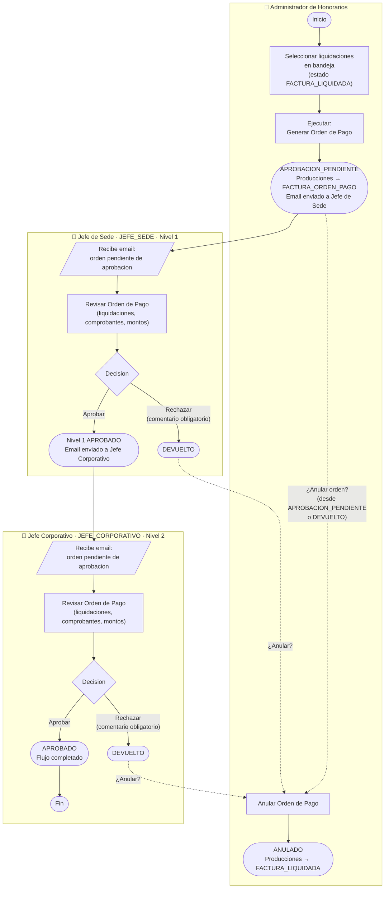

# Flujo de Estados de Orden de Pago
## Sistema de Honorarios Medicos (SHM)

**Version:** 1.3
**Fecha:** 17 de Febrero 2026
**Actualizado:** 09 de Abril 2026 - Correcciones: formato numero de orden, estado ANULADO en SQL, vistas de historial, comentario obligatorio al rechazar
**Autor:** ADG Vladimir D

---

## 1. Descripcion General

Este documento describe el flujo de estados del proceso de Orden de Pago en el Sistema de Honorarios Medicos. La Orden de Pago se genera a partir de liquidaciones aprobadas y requiere un flujo de aprobacion por multiples niveles antes de proceder al pago.

---

## 2. Actores del Sistema

| Actor | Portal | Descripcion |
|-------|--------|-------------|
| **Generador** | Portal HHMM (Administrativo) | Personal que genera la Orden de Pago desde la bandeja de Liquidaciones |
| **Aprobador** | Portal HHMM (Administrativo) | Usuarios asignados en SHM_PERFIL_APROBACION_USUARIO para el flujo FLUJO_APROBACION_ORDEN_PAGO |

---

## 3. Tablas Involucradas

| Tabla | Descripcion |
|-------|-------------|
| `SHM_ORDEN_PAGO` | Cabecera de la orden de pago. Contiene totales, banco, sede y estado general |
| `SHM_ORDEN_PAGO_PRODUCCION` | Relacion entre la orden de pago y las producciones incluidas |
| `SHM_ORDEN_PAGO_LIQUIDACION` | Detalle por liquidacion agrupada dentro de la orden de pago |
| `SHM_ORDEN_PAGO_APROBACION` | Registro de aprobacion por cada nivel/perfil. Controla el flujo de aprobacion |
| `SHM_PERFIL_APROBACION` | Plantilla que define los niveles de aprobacion para FLUJO_APROBACION_ORDEN_PAGO |
| `SHM_PERFIL_APROBACION_USUARIO` | Usuarios asignados a cada perfil de aprobacion por sede |
| `SHM_PRODUCCION` | Producciones cuyo estado cambia a FACTURA_ORDEN_PAGO al generar la orden |

---

## 4. Estados del Proceso

### 4.1 Estados de SHM_ORDEN_PAGO

| Estado | Codigo | Descripcion |
|--------|--------|-------------|
| Aprobacion Pendiente | `APROBACION_PENDIENTE` | Estado inicial. La orden fue generada y esta pendiente de aprobacion |
| Aprobado | `APROBADO` | Todos los niveles de aprobacion han sido completados |
| Devuelto | `DEVUELTO` | Algun aprobador rechazo la orden de pago |
| Anulado | `ANULADO` | La orden fue anulada manualmente. Las producciones vuelven a `FACTURA_LIQUIDADA` |

### 4.2 Estados de SHM_ORDEN_PAGO_APROBACION

| Estado | Codigo | Descripcion |
|--------|--------|-------------|
| Aprobacion Pendiente | `APROBACION_PENDIENTE` | El nivel de aprobacion aun no ha sido atendido |
| Aprobado | `APROBADO` | El aprobador aprobo la orden en este nivel |
| Devuelto | `DEVUELTO` | El aprobador rechazo la orden en este nivel |

---

## 5. Diagrama de Flujo (Estados)

Representa las transiciones de estado de `SHM_ORDEN_PAGO` y las acciones que las desencadenan.

```
    +-------------------------------------------------------------------------+
    |                                                                         |
    |   FACTURA_LIQUIDADA (producciones en bandeja de Liquidaciones)           |
    |              |                                                          |
    |              | [Generador selecciona liquidaciones]                      |
    |              | [y ejecuta "Generar Orden de Pago"]                      |
    |              v                                                          |
    |   +---------------------+                                               |
    |   | APROBACION_PENDIENTE|  <- Estado Inicial de Orden de Pago           |
    |   |  (SHM_ORDEN_PAGO)   |                                               |
    |   +----+----------+-----+                                               |
    |        |          |                                                     |
    |   [Anular]        | NIVEL 1: JEFE_SEDE (orden=1)                        |
    |        |          | notificado por email al generar                     |
    |        v          v                                                     |
    |        |   +------+------+                                              |
    |        |   |             |                                              |
    |        |   v             v                                              |
    |        |  [Rechazar]  [Aprobar]                                         |
    |        |   |             |                                              |
    |        |   v             v                                              |
    |        |  +---------+  +---------------------+                          |
    |        |  | DEVUELTO|  | APROBADO (JEFE_SEDE) |                         |
    |        |  +----+----+  +----------+----------+                          |
    |        |       |                  |                                     |
    |        |  [Anular]     NIVEL 2: JEFE_CORPORATIVO (orden=2)              |
    |        |       |       notificado por email al aprobar nivel 1          |
    |        |       |                  v                                     |
    |        |       |   +-------------+-------------+                        |
    |        |       |   |                           |                        |
    |        |       |   v                           v                        |
    |        |       |  [Rechazar]               [Aprobar]                    |
    |        |       |   |                           |                        |
    |        |       |   v                           v                        |
    |        |       |  +---------+           +---------+                     |
    |        |       |  | DEVUELTO|           | APROBADO|  <- Orden aprobada  |
    |        |       |  +----+----+           +---------+                     |
    |        |       |       |                                                |
    |        |       |  [Anular]                                              |
    |        v       v       v                                                |
    |      +---------+                                                        |
    |      | ANULADO |  <- Producciones vuelven a FACTURA_LIQUIDADA           |
    |      +---------+                                                        |
    |                                                                         |
    |   DEVUELTO (sin anular): Se debe volver a generar la Orden de Pago      |
    |   (Vuelve a bandeja de Liquidaciones)                                   |
    |                                                                         |
    +-------------------------------------------------------------------------+
```

---

## 6. Diagrama de Proceso BPMN (Bizagi)

Representa el flujo de trabajo por actor con swimlanes: quién hace qué y cuándo.



---

## 7. Descripcion Detallada de Cada Evento

### 7.1 Generar Orden de Pago

- **Actor:** Generador (Empresa)
- **Origen:** Bandeja de Liquidaciones (`/Liquidacion/Index`)
- **Controlador:** `LiquidacionController.GenerarOrdenPago`
- **Precondiciones:**
  - Las producciones deben estar en estado `FACTURA_LIQUIDADA`
  - Se debe seleccionar al menos una liquidacion
  - Todas las liquidaciones deben pertenecer al mismo banco

**Acciones ejecutadas:**

| # | Tabla | Accion | Detalle |
|---|-------|--------|---------|
| 1 | `SHM_ORDEN_PAGO` | INSERT | Se crea la cabecera con estado `APROBACION_PENDIENTE`, totales acumulados, banco y sede |
| 2 | `SHM_ORDEN_PAGO_PRODUCCION` | INSERT (bulk) | Un registro por cada produccion incluida en la orden |
| 3 | `SHM_ORDEN_PAGO_LIQUIDACION` | INSERT | Un registro por cada codigo de liquidacion agrupado, con totales y datos de la liquidacion |
| 4 | `SHM_ORDEN_PAGO_APROBACION` | INSERT | Dos registros: uno para `JEFE_SEDE` (orden=1) y otro para `JEFE_CORPORATIVO` (orden=2), ambos con estado `APROBACION_PENDIENTE` |
| 5 | `SHM_PRODUCCION` | UPDATE | Estado de las producciones cambia de `FACTURA_LIQUIDADA` a `FACTURA_ORDEN_PAGO` |
| 6 | - | EMAIL | Se notifica por correo a los usuarios del perfil `JEFE_SEDE` de la sede correspondiente (ver seccion 12) |

**Formato del numero de orden:** `OP-{CodigoSede}-{YYYY}{MM}{XX}` donde `CodigoSede` es el codigo de la sede (ej: `HN`) y `XX` es un correlativo de 2 digitos por sede/año/mes. Ejemplo: `OP-HN-20260401`

### 7.2 Anular Orden de Pago

- **Actor:** Usuario con acceso a la opcion (no requiere rol especifico de aprobacion)
- **Controlador:** `OrdenPagoController.Anular`
- **Precondiciones:** La orden debe estar en estado `APROBACION_PENDIENTE` o `DEVUELTO`

**Acciones ejecutadas (dentro de una transaccion Oracle):**

| # | Tabla | Accion | Detalle |
|---|-------|--------|---------|
| 1 | `SHM_ORDEN_PAGO` | UPDATE | Estado cambia a `ANULADO`. Se registra `ID_MODIFICADOR` y `FECHA_MODIFICACION` |
| 2 | `SHM_PRODUCCION` | UPDATE (bulk) | Estado de las producciones cambia de `FACTURA_ORDEN_PAGO` a `FACTURA_LIQUIDADA`. Se obtienen via `SHM_ORDEN_PAGO_PRODUCCION.ID_PRODUCCION` |
| 3 | - | BITACORA | Se registra la accion en la bitacora del sistema |

**Consecuencia:** Las producciones quedan disponibles nuevamente en la bandeja de Liquidaciones para generar una nueva Orden de Pago.

---

### 7.3 Rechazar Orden de Pago

- **Actor:** Aprobador
- **Controlador:** `OrdenPagoAprobacionController.Rechazar`
- **Precondiciones:** La orden debe estar en estado `APROBACION_PENDIENTE`
- **Nota:** El comentario de rechazo es **obligatorio**. El controlador valida que no este vacio antes de procesar

**Acciones ejecutadas:**

| # | Tabla | Accion | Detalle |
|---|-------|--------|---------|
| 1 | `SHM_ORDEN_PAGO_APROBACION` | UPDATE | El registro del aprobador que rechaza pasa a estado `DEVUELTO`. Se registra `ID_USUARIO_APROBADOR` y `FECHA_APROBACION` |
| 2 | `SHM_ORDEN_PAGO` | UPDATE | Estado cambia a `DEVUELTO` |
| 3 | - | BITACORA | Se registra la accion con el comentario del rechazo |

**Consecuencia:** La orden queda en estado `DEVUELTO`. Puede ser anulada (ver 7.2) o el generador puede crear una nueva Orden de Pago desde la bandeja de Liquidaciones (paso 7.1).

### 7.4 Aprobar Orden de Pago

- **Actor:** Aprobador
- **Controlador:** `OrdenPagoAprobacionController.Aprobar`
- **Precondiciones:** La orden debe estar en estado `APROBACION_PENDIENTE`

**Acciones ejecutadas:**

| # | Tabla | Accion | Detalle |
|---|-------|--------|---------|
| 1 | `SHM_ORDEN_PAGO_APROBACION` | UPDATE | El registro del aprobador pasa a estado `APROBADO`. Se registra `ID_USUARIO_APROBADOR` y `FECHA_APROBACION` |
| 2 | `SHM_ORDEN_PAGO` | UPDATE (condicional) | Si **todos** los registros de `SHM_ORDEN_PAGO_APROBACION` para esta orden estan en estado `APROBADO`, entonces el estado de la orden cambia a `APROBADO` |
| 3 | - | EMAIL (condicional) | Si quedan niveles pendientes, se notifica por correo a los usuarios del **siguiente nivel** de aprobacion (ver seccion 12) |
| 4 | - | BITACORA | Se registra si fue aprobacion parcial (nivel) o aprobacion total (orden completa) |

**Regla de negocio:** La orden solo se aprueba completamente cuando el ultimo nivel pendiente da su aprobacion.

---

## 8. Flujo de Aprobacion

El flujo de aprobacion se basa en perfiles configurados en `SHM_PERFIL_APROBACION`. Existen **2 niveles secuenciales**:

| Nivel | Codigo | Descripcion | Orden |
|-------|--------|-------------|-------|
| 1 | `JEFE_SEDE` | Jefe de Sede | 1 |
| 2 | `JEFE_CORPORATIVO` | Jefe Corporativo | 2 |

```
SHM_PERFIL_APROBACION (plantilla)
  GRUPO_FLUJO_TRABAJO = 'FLUJO_APROBACION_ORDEN_PAGO'
  +------------------+---------------------------+-------+
  | CODIGO           | DESCRIPCION               | ORDEN |
  +------------------+---------------------------+-------+
  | JEFE_SEDE        | Jefe de Sede              |   1   |
  | JEFE_CORPORATIVO | Jefe Corporativo          |   2   |
  +------------------+---------------------------+-------+

SHM_PERFIL_APROBACION_USUARIO (usuarios asignados por sede)
  +----------------------+------------+---------+
  | ID_PERFIL_APROBACION | ID_USUARIO | ID_SEDE |
  +----------------------+------------+---------+
  Nota: ID_SEDE = NULL indica que el usuario aplica a todas las sedes

SHM_ORDEN_PAGO_APROBACION (instancias creadas por orden)
  +---------------+---------------------+-----------------------+
  | ID_ORDEN_PAGO | CODIGO_PERFIL        | ESTADO                |
  +---------------+---------------------+-----------------------+
  |     100       | JEFE_SEDE           | APROBACION_PENDIENTE  |
  |     100       | JEFE_CORPORATIVO    | APROBACION_PENDIENTE  |
  +---------------+---------------------+-----------------------+
```

---

## 9. Transiciones de Estado

### SHM_ORDEN_PAGO

| # | Estado Origen | Estado Destino | Accion | Condicion |
|---|---------------|----------------|--------|-----------|
| 1 | (nuevo) | APROBACION_PENDIENTE | Generar Orden de Pago | - |
| 2 | APROBACION_PENDIENTE | DEVUELTO | Algun aprobador rechaza | JEFE_SEDE o JEFE_CORPORATIVO rechaza |
| 3 | APROBACION_PENDIENTE | APROBADO | Ultimo aprobador aprueba | JEFE_SEDE y JEFE_CORPORATIVO en estado APROBADO |
| 4 | APROBACION_PENDIENTE | ANULADO | Usuario anula la orden | Usuario con acceso a la opcion |
| 5 | DEVUELTO | ANULADO | Usuario anula la orden | Usuario con acceso a la opcion |

### SHM_ORDEN_PAGO_APROBACION

| # | Estado Origen | Estado Destino | Accion | Actor |
|---|---------------|----------------|--------|-------|
| 1 | (nuevo) | APROBACION_PENDIENTE | Generar Orden de Pago | Sistema |
| 2 | APROBACION_PENDIENTE | APROBADO | Aprobar | Aprobador del nivel (JEFE_SEDE o JEFE_CORPORATIVO) |
| 3 | APROBACION_PENDIENTE | DEVUELTO | Rechazar | Aprobador del nivel (JEFE_SEDE o JEFE_CORPORATIVO) |

### SHM_PRODUCCION (estados relacionados)

| # | Estado Origen | Estado Destino | Accion |
|---|---------------|----------------|--------|
| 1 | FACTURA_LIQUIDADA | FACTURA_ORDEN_PAGO | Generar Orden de Pago |
| 2 | FACTURA_ORDEN_PAGO | FACTURA_LIQUIDADA | Anular Orden de Pago |

---

## 10. Estructura de Tablas

### SHM_ORDEN_PAGO
```sql
ID_ORDEN_PAGO         Number NOT NULL    -- PK
ID_SEDE               Number NOT NULL    -- FK a SHM_SEDE
ID_BANCO              Number NOT NULL    -- FK a SHM_BANCO
NUMERO_ORDEN_PAGO     Varchar2(20)       -- Formato: OP-YYYYMMDD-HHmmss
FECHA_GENERACION      Date
ESTADO                Varchar2(30)       -- APROBACION_PENDIENTE | APROBADO | DEVUELTO | ANULADO
MTO_CONSUMO_ACUM      Number
MTO_DESCUENTO_ACUM    Number
MTO_SUBTOTAL_ACUM     Number
MTO_RENTA_ACUM        Number
MTO_IGV_ACUM          Number
MTO_TOTAL_ACUM        Number
CANT_COMPROBANTES     Number
CANT_LIQUIDACIONES    Number
COMENTARIOS           Varchar2(1000)
-- Campos de auditoria estandar
```

### SHM_ORDEN_PAGO_APROBACION
```sql
ID_ORDEN_PAGO_APROBACION  Number NOT NULL   -- PK
ID_ORDEN_PAGO             Number NOT NULL   -- FK a SHM_ORDEN_PAGO
ID_PERFIL_APROBACION      Number NOT NULL   -- FK a SHM_PERFIL_APROBACION
ESTADO                    Varchar2(30)      -- APROBACION_PENDIENTE | APROBADO | DEVUELTO
ID_USUARIO_APROBADOR      Number            -- FK a SHM_SEG_USUARIO (se llena al aprobar/rechazar)
FECHA_APROBACION          Date              -- Se llena al aprobar/rechazar
ORDEN                     Number(3)         -- Orden secuencial del nivel
-- Campos de auditoria estandar
```

### SHM_ORDEN_PAGO_PRODUCCION
```sql
ID_ORDEN_PAGO_PRODUCCION  Number NOT NULL   -- PK
ID_ORDEN_PAGO             Number NOT NULL   -- FK a SHM_ORDEN_PAGO
ID_PRODUCCION             Number NOT NULL   -- FK a SHM_PRODUCCION
-- Campos de auditoria estandar
```

### SHM_ORDEN_PAGO_LIQUIDACION
```sql
ID_ORDEN_PAGO_LIQUIDACION Number NOT NULL   -- PK
ID_ORDEN_PAGO             Number            -- FK a SHM_ORDEN_PAGO
NUMERO_LIQUIDACION        Varchar2(20)
CODIGO_LIQUIDACION        Varchar2(20)
TIPO_LIQUIDACION          Varchar2(5)
DESCRIPCION_LIQUIDACION   Varchar2(300)
PERIODO_LIQUIDACION       Varchar2(10)
ID_BANCO                  Number
MTO_CONSUMO_ACUM          Number
MTO_DESCUENTO_ACUM        Number
MTO_SUBTOTAL_ACUM         Number
MTO_RENTA_ACUM            Number
MTO_IGV_ACUM              Number
MTO_TOTAL_ACUM            Number
CANT_COMPROBANTES         Number
COMENTARIOS               Varchar2(1000)
-- Campos de auditoria estandar
```

---

## 11. Reglas de Negocio

1. **Mismo banco:** Todas las liquidaciones seleccionadas para una orden deben pertenecer al mismo banco
2. **Estado previo:** Solo producciones en estado `FACTURA_LIQUIDADA` pueden incluirse en una orden de pago
3. **Flujo de aprobacion:** Los niveles de aprobacion se crean automaticamente desde `SHM_PERFIL_APROBACION` con `GRUPO_FLUJO_TRABAJO = 'FLUJO_APROBACION_ORDEN_PAGO'`
4. **Rechazo inmediato:** Si cualquier aprobador rechaza, toda la orden pasa a estado `DEVUELTO`
5. **Aprobacion completa:** La orden solo pasa a `APROBADO` cuando todos los registros de `SHM_ORDEN_PAGO_APROBACION` estan en estado `APROBADO`
6. **Anulacion:** Una orden en estado `APROBACION_PENDIENTE` o `DEVUELTO` puede ser anulada. Al anularse, las producciones vuelven a `FACTURA_LIQUIDADA` y quedan disponibles para una nueva orden
7. **Regeneracion:** Una orden en estado `DEVUELTO` (no anulada) puede regenerarse desde la bandeja de Liquidaciones
8. **Trazabilidad:** Cada aprobacion/rechazo/anulacion registra el usuario y la fecha en la bitacora
9. **Producciones via SHM_ORDEN_PAGO_PRODUCCION:** El vinculo entre la orden y sus producciones se gestiona exclusivamente a traves de `SHM_ORDEN_PAGO_PRODUCCION.ID_PRODUCCION`

---

## 12. Notificaciones por Email

El sistema envia notificaciones por correo electronico a los aprobadores en dos momentos del flujo:

### 12.1 Al Generar la Orden de Pago

- **Evento:** `LiquidacionController.GenerarOrdenPago`
- **Servicio:** `OrdenPagoAprobacionService.NotificarPrimerAprobadorAsync`
- **Destinatarios:** Usuarios asignados al perfil **`JEFE_SEDE`** (primer nivel, orden=1) filtrados por la sede de la orden
- **Momento:** Despues de crear todos los registros y actualizar el estado de las producciones

### 12.2 Al Aprobar un Nivel

- **Evento:** `OrdenPagoAprobacionService.AprobarAsync`
- **Servicio:** `OrdenPagoAprobacionService.NotificarSiguienteAprobadorAsync` (privado)
- **Destinatarios:** Usuarios asignados al perfil **`JEFE_CORPORATIVO`** (siguiente nivel, orden=2) cuando `JEFE_SEDE` aprueba
- **Momento:** Despues de que `JEFE_SEDE` aprueba, notifica a `JEFE_CORPORATIVO`
- **No se notifica** cuando `JEFE_CORPORATIVO` aprueba (la orden pasa a estado `APROBADO`)

### 12.3 Logica de Seleccion de Destinatarios

```
1. Obtener el siguiente registro de SHM_ORDEN_PAGO_APROBACION
   con ESTADO = 'APROBACION_PENDIENTE' ordenado por ORDEN ASC (el primero)

2. Obtener los usuarios de SHM_PERFIL_APROBACION_USUARIO
   donde ID_PERFIL_APROBACION = perfil del siguiente nivel

3. Filtrar por sede:
   - Usuarios con ID_SEDE = NULL (aplican a todas las sedes)
   - Usuarios con ID_SEDE = sede de la orden de pago (SHM_ORDEN_PAGO.ID_SEDE)

4. Para cada usuario filtrado:
   - Obtener datos de SHM_SEG_USUARIO (nombre, email)
   - Enviar correo si tiene email configurado
```

### 12.4 Plantilla de Email

Se utiliza `IEmailService.EnviarEmailNotificacionAprobacionAsync` con los siguientes datos:

| Dato | Origen |
|------|--------|
| Email destinatario | `SHM_SEG_USUARIO.EMAIL` |
| Nombre destinatario | `NOMBRES + APELLIDO_PATERNO + APELLIDO_MATERNO` |
| Numero de orden | `SHM_ORDEN_PAGO.NUMERO_ORDEN_PAGO` |
| Fecha de generacion | `SHM_ORDEN_PAGO.FECHA_GENERACION` |
| Monto total | `SHM_ORDEN_PAGO.MTO_TOTAL_ACUM` |
| Nombre del perfil | `SHM_PERFIL_APROBACION.DESCRIPCION` (del nivel pendiente) |
| ID orden de pago | `SHM_ORDEN_PAGO.ID_ORDEN_PAGO` |

### 12.5 Manejo de Errores

- Los errores en el envio de correo **no interrumpen** el flujo principal
- Los errores se registran en el log con nivel `LogError`
- La generacion de la orden o la aprobacion se completa exitosamente aunque falle el envio del correo

### 12.6 Diagrama de Notificaciones

```
  Generar Orden de Pago
         |
         v
  [Crear registros en BD]
         |
         v
  [Notificar JEFE_SEDE] --email--> Usuarios JEFE_SEDE (sede de la orden)
         |
         v
  (JEFE_SEDE aprueba)
         |
         v
  [Quedan niveles pendientes? -> Si: JEFE_CORPORATIVO pendiente]
         |
    Si ---+--- No
    |           |
    v           v
  [Notificar   (Orden APROBADA,
   JEFE_CORP]   no se notifica)
    |
    v
  --email--> Usuarios JEFE_CORPORATIVO (sin filtro de sede, aplican a todas)
         |
         v
  (JEFE_CORPORATIVO aprueba)
         |
         v
  [Quedan niveles pendientes? -> No]
         |
         v
  (Orden APROBADA, no se notifica)
```

---

## 13. Vistas del Portal de Aprobadores

Ademas de la bandeja de ordenes pendientes, el aprobador dispone de las siguientes vistas:

| Vista | URL | Controlador | Descripcion |
|-------|-----|-------------|-------------|
| Bandeja pendientes | `/OrdenPagoAprobacion` | `OrdenPagoAprobacionController.Index` | Ordenes en estado `APROBACION_PENDIENTE` donde el usuario tiene turno de aprobar |
| Historial aprobadas | `/OrdenPagoAprobacion/Aprobadas` | `OrdenPagoAprobacionController.Aprobadas` | Ordenes donde el usuario ya aprobo su nivel |
| Detalle para aprobar | `/OrdenPagoAprobacion/Detalle/{guid}` | `OrdenPagoAprobacionController.Detalle` | Vista completa con botones Aprobar/Rechazar |
| Detalle aprobada | `/OrdenPagoAprobacion/DetalleAprobada/{guid}` | `OrdenPagoAprobacionController.DetalleAprobada` | Vista de solo consulta (sin acciones), para ordenes ya procesadas |

---

## 14. Consulta de Log de Correos

El sistema registra todos los correos enviados en la tabla `SHM_EMAIL_LOG`. Existe una opcion de consulta en el portal administrativo:

- **URL:** `/EmailLog`
- **Controlador:** `EmailLogController.Index`
- **Filtros disponibles:** Tipo de correo, Estado (ENVIADO/ERROR), Email destino
- **Visor:** Permite visualizar el contenido HTML del correo enviado

### Tipos de correo registrados

| TipoEmail | Evento |
|-----------|--------|
| `NUEVO_USUARIO` | Creacion de nuevo usuario en el sistema |
| `RESET_CLAVE` | Restablecimiento de clave por administrador |
| `RECUPERACION_CLAVE` | Solicitud de recuperacion de clave por el usuario |
| `SOLICITUD_FACTURA` | Notificacion de solicitud de factura a compania medica |
| `NOTIFICACION_APROBACION` | Notificacion a aprobador con orden pendiente |

---

*Documento generado para el Sistema de Honorarios Medicos (SHM) - Grupo San Pablo*
