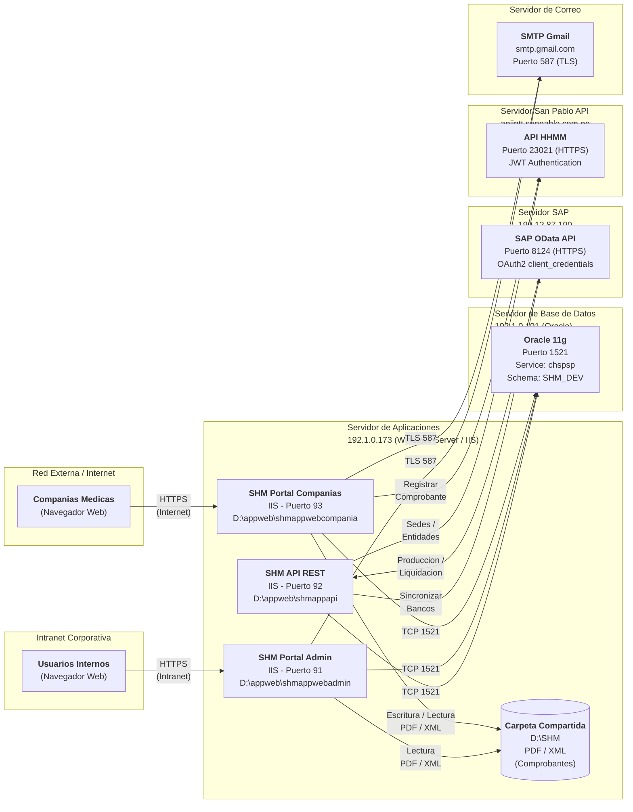
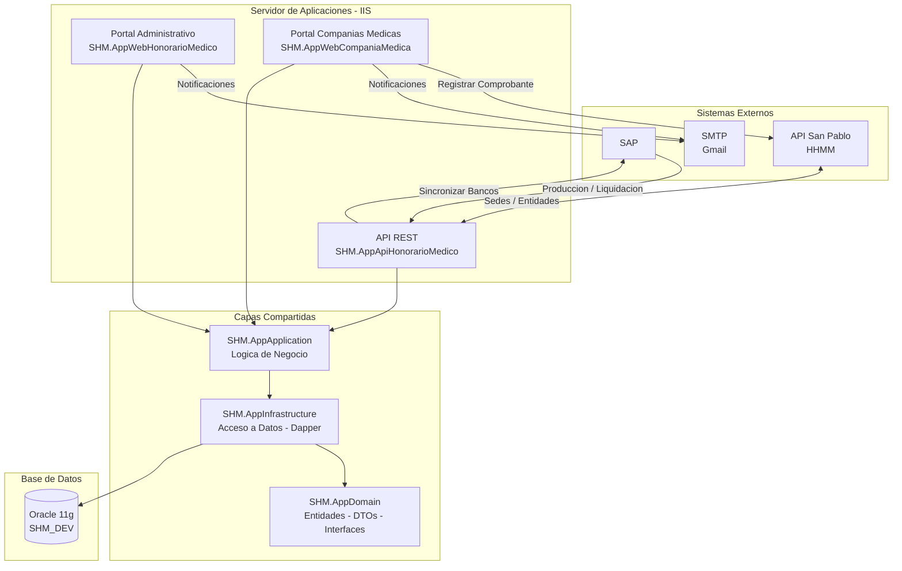

# Guia de Despliegue a Produccion - SHM (Sistema de Honorarios Medicos)

---

## Informacion del Proyecto

<table>
<tr>
<td width="50%" align="center">


**Cliente**

**Complejo Hospitalario San Pablo**

</td>
<td width="50%" align="center">


**Desarrollado por**

**ADG Systems**

</td>
</tr>
</table>

| Atributo | Valor |
|----------|-------|
| **Proyecto** | Gestion de Honorarios Medicos |
| **Documento** | Guia de Despliegue a Produccion |
| **Cliente** | Complejo Hospitalario San Pablo |
| **Desarrollador** | ADG Systems |
| **Framework** | ASP.NET Core 8 |
| **Base de Datos** | Oracle 11g |
| **Version** | 1.0 |
| **Fecha** | Marzo 2026 |

---

## Descripcion General

El Sistema de Honorarios Medicos (SHM) es una plataforma web desarrollada para el Complejo Hospitalario San Pablo que gestiona el ciclo completo de honorarios medicos, desde el registro de la produccion medica hasta la generacion de ordenes de pago.

El sistema se compone de tres aplicaciones:

- **API REST:** Punto de integracion con los sistemas externos SAP y HHMM de San Pablo. Recibe la produccion medica, procesa liquidaciones y sincroniza datos maestros (sedes, bancos).
- **Portal Administrativo:** Aplicacion web interna para la gestion de honorarios. Permite administrar usuarios, roles, sedes, entidades medicas, produccion, archivos, ordenes de pago, perfiles de aprobacion y parametros del sistema.
- **Portal Companias Medicas:** Aplicacion web para las companias medicas externas. Permite consultar su produccion, registrar comprobantes (facturas/recibos por honorarios) y dar seguimiento al estado de sus pagos.

### Flujo principal

1. SAP envia la produccion medica al API (interface de produccion)
2. Las companias medicas registran sus comprobantes a traves del Portal de Companias
3. Los comprobantes se envian al sistema HHMM de San Pablo para validacion
4. SAP envia los datos de liquidacion al API (interface de liquidacion)
5. El area administrativa genera ordenes de pago desde el Portal Administrativo
6. Las ordenes pasan por un flujo de aprobacion configurable
7. Se procesan los pagos a las companias medicas

---

## 1. Arquitectura de la Solucion

### Diagrama de Despliegue

El siguiente diagrama muestra los servidores fisicos/virtuales que intervienen en la solucion y la comunicacion entre ellos:



> **Nota:** Los puertos e IPs mostrados son de referencia. Ajustar segun el ambiente de produccion.
>
> Si el visualizador no soporta Mermaid, guardar como imagen en `docs/images/diagrama_despliegue.png`:
> ```markdown
> 
> ```

### Inventario de Componentes

La siguiente tabla resume todos los componentes que intervienen en la solucion:

| # | Componente | Servidor / Host | Puerto | Protocolo | Tipo | Acceso de Red |
|---|-----------|----------------|--------|-----------|------|---------------|
| 1 | SHM API REST | 192.1.0.173 (IIS) | 92 | HTTPS | Web API (.NET 8) | Intranet |
| 2 | SHM Portal Administrativo | 192.1.0.173 (IIS) | 91 | HTTPS | Web MVC (.NET 8) | Intranet |
| 3 | SHM Portal Companias Medicas | 192.1.0.173 (IIS) | 93 | HTTPS | Web MVC (.NET 8) | Internet |
| 4 | Carpeta Compartida (D:\SHM) | 192.1.0.173 | N/A | Sistema de archivos | Almacenamiento | Local |
| 5 | Oracle Database | 192.1.0.191 | 1521 | TCP (Oracle Net) | Base de datos | Intranet |
| 6 | SAP OData API | 190.12.87.190 | 8124 | HTTPS | API Externa | Internet |
| 7 | API San Pablo HHMM | apiintt.sanpablo.com.pe | 23021 | HTTPS | API Externa | Internet |
| 8 | Servidor de Correo (SMTP) | smtp.gmail.com | 587 | TLS | Servicio externo | Internet |

### Descripcion Detallada de Componentes

#### 1. SHM API REST (`SHM.AppApiHonorarioMedico`)

| Caracteristica | Detalle |
|----------------|---------|
| **Proyecto** | SHM.AppApiHonorarioMedico |
| **Ruta de despliegue** | D:\appweb\shmappapi |
| **Application Pool** | shm_api_pool (No Managed Code) |
| **Puerto** | 92 |
| **Framework** | ASP.NET Core 8 (out-of-process) |
| **Acceso** | Solo Intranet |

**Funcion:** API REST que recibe datos de produccion y liquidacion desde el sistema San Pablo. Tambien sincroniza informacion maestra (sedes, bancos) consumiendo APIs externas (San Pablo y SAP).

**Endpoints principales:**
- `POST /api/ProduccionInterface/producciones` — Recibe lotes de produccion
- `POST /api/ProduccionInterface/liquidaciones` — Recibe liquidaciones
- `POST /api/SedeInterface/sync` — Sincroniza sedes desde API San Pablo
- `POST /api/SapInterface/sincronizar-bancos` — Sincroniza bancos desde SAP OData

**Dependencias:**
- Oracle Database (192.1.0.191:1521)
- SAP OData API (190.12.87.190:8124)
- API San Pablo HHMM (apiintt.sanpablo.com.pe:23021)

---

#### 2. SHM Portal Administrativo (`SHM.AppWebHonorarioMedico`)

| Caracteristica | Detalle |
|----------------|---------|
| **Proyecto** | SHM.AppWebHonorarioMedico |
| **Ruta de despliegue** | D:\appweb\shmappwebadmin |
| **Application Pool** | shm_webadmin_pool (No Managed Code) |
| **Puerto** | 91 |
| **Framework** | ASP.NET Core 8 MVC (out-of-process) |
| **Acceso** | Solo Intranet |

**Funcion:** Portal web para usuarios internos del Grupo San Pablo (administradores, contabilidad). Permite gestionar entidades medicas, revisar produccion, aprobar/rechazar facturas, generar ordenes de pago y administrar la configuracion del sistema.

**Caracteristicas:**
- Autenticacion por Cookie con Claims (expiracion 30 min sliding)
- Gestion de usuarios, roles y permisos
- Tablero de control con indicadores
- Reportes de produccion y liquidacion
- Lectura de comprobantes PDF/XML desde carpeta compartida

**Dependencias:**
- Oracle Database (192.1.0.191:1521)
- Carpeta compartida D:\SHM (lectura)
- SMTP Gmail (smtp.gmail.com:587)

---

#### 3. SHM Portal Companias Medicas (`SHM.AppWebCompaniaMedica`)

| Caracteristica | Detalle |
|----------------|---------|
| **Proyecto** | SHM.AppWebCompaniaMedica |
| **Ruta de despliegue** | D:\appweb\shmappwebcompania |
| **Application Pool** | shm_webcompania_pool (No Managed Code) |
| **Puerto** | 93 |
| **Framework** | ASP.NET Core 8 MVC (out-of-process) |
| **Acceso** | Internet (companias medicas externas) |

**Funcion:** Portal web para companias medicas externas. Permite consultar su produccion, registrar facturas/comprobantes, cargar archivos PDF/XML, y dar seguimiento al estado de sus pagos.

**Caracteristicas:**
- Autenticacion por Cookie con Claims (expiracion 30 min sliding)
- Carga de archivos PDF y XML de comprobantes
- Consulta de produccion por periodo y sede
- Seguimiento del estado de facturas y pagos
- Registro de comprobantes en API San Pablo HHMM

**Dependencias:**
- Oracle Database (192.1.0.191:1521)
- Carpeta compartida D:\SHM (lectura y escritura)
- API San Pablo HHMM (apiintt.sanpablo.com.pe:23021)
- SMTP Gmail (smtp.gmail.com:587)

**Consideraciones de seguridad:**
- Este portal esta expuesto a Internet; requiere certificado SSL valido
- Configurar firewall para permitir solo trafico HTTPS en el puerto configurado
- Implementar proteccion contra ataques (rate limiting, WAF recomendado)

---

#### 4. Carpeta Compartida (`D:\SHM`)

| Caracteristica | Detalle |
|----------------|---------|
| **Ruta** | D:\SHM |
| **Servidor** | 192.1.0.173 |
| **Tipo** | Directorio local del servidor de aplicaciones |

**Funcion:** Almacena los archivos PDF y XML de comprobantes que las companias medicas cargan desde el Portal de Companias. El Portal Administrativo los consulta para revision y aprobacion.

**Estructura sugerida:**
```
D:\SHM\
├── Comprobantes\
│   ├── 2026\
│   │   ├── 01\        ← Organizados por año/mes
│   │   ├── 02\
│   │   └── ...
│   └── ...
└── Temp\               ← Archivos temporales de carga
```

**Permisos requeridos:**
- Application Pool `shm_webcompania_pool` → Lectura y Escritura
- Application Pool `shm_webadmin_pool` → Lectura
- Application Pool `shm_api_pool` → Sin acceso (no lo requiere)

---

#### 5. Oracle Database

| Caracteristica | Detalle |
|----------------|---------|
| **Servidor** | 192.1.0.191 |
| **Puerto** | 1521 |
| **Service Name** | chspsp |
| **Schema** | SHM_DEV |
| **Version** | Oracle 11g |

**Funcion:** Base de datos relacional que almacena toda la informacion del sistema: usuarios, roles, produccion medica, entidades, comprobantes, parametros, bitacoras, etc.

**Caracteristicas:**
- Acceso via Dapper (micro ORM) — no utiliza Entity Framework
- Todas las tablas con prefijo `SHM_`
- Secuencias para generacion de IDs (`SHM_*_SEQ`)
- Campos de auditoria en todas las tablas (GUID_REGISTRO, ACTIVO, ID_CREADOR, FECHA_CREACION, etc.)
- Soft delete (ACTIVO = 1/0)

**Tablas principales:** 15+ tablas incluyendo SHM_SEG_USUARIO, SHM_PRODUCCION, SHM_ENTIDAD_MEDICA, SHM_SEDE, SHM_BANCO, SHM_ARCHIVO, SHM_ARCHIVO_COMPROBANTE, entre otras.

---

#### 6. SAP OData API

| Caracteristica | Detalle |
|----------------|---------|
| **Host** | 190.12.87.190 |
| **Puerto** | 8124 |
| **Protocolo** | HTTPS |
| **Autenticacion** | OAuth2 (client_credentials + Basic Auth) |

**Funcion:** Provee informacion maestra desde SAP, como codigos de banco. Se consume desde el API REST para sincronizar datos de referencia.

**Endpoints consumidos:**
- `POST /sap/bc/sec/oauth2/token` — Obtener token OAuth2
- `GET /sap/opu/odata/sap/ZODGS_PORTAL_HHMM_SRV/COD_BANCOSet` — Listado de bancos

**Formato de respuesta:** OData `{ "d": { "results": [...] } }`

**Nota:** El certificado SSL del servidor SAP puede ser autofirmado; se configura bypass de validacion de certificado en el HttpClient.

---

#### 7. API San Pablo HHMM

| Caracteristica | Detalle |
|----------------|---------|
| **Host** | apiintt.sanpablo.com.pe |
| **Puerto** | 23021 |
| **Protocolo** | HTTPS |
| **Autenticacion** | JWT (login con usuario/password) |

**Funcion:** API del sistema San Pablo HHMM. Provee informacion de sedes, entidades medicas y permite el registro de comprobantes. Tambien envia produccion y liquidaciones al SHM API REST.

**Endpoints consumidos:**
- `POST /login` — Autenticacion JWT
- `GET /sedes` — Listado de sedes
- `GET /entidades` — Listado de entidades medicas
- `POST /comprobantes` — Registrar comprobante

**Formato de respuesta:** JSON `{ "isSuccess": true, "data": [...] }`

---

#### 8. Servidor de Correo (SMTP)

| Caracteristica | Detalle |
|----------------|---------|
| **Host** | smtp.gmail.com |
| **Puerto** | 587 |
| **Protocolo** | TLS |
| **Autenticacion** | App Password de Google |

**Funcion:** Envio de correos electronicos de notificacion a usuarios del sistema (notificaciones de produccion, cambios de estado, recuperacion de password, etc.).

**Configuracion requerida:**
- Cuenta de Gmail con App Password habilitado
- No usar password de la cuenta directamente
- Configurar en `appsettings.json` seccion `EmailSettings`

---

### Diagrama de Arquitectura de Software



> **Nota:** Si el visualizador de Markdown no soporta Mermaid, puede reemplazar este bloque por una imagen en `docs/images/arquitectura_solucion.png`:
>
> ```markdown
> 
> ```

La solucion esta compuesta por 3 aplicaciones independientes que comparten la misma base de datos Oracle:

| Componente | Proyecto | Tipo | Puerto Dev | Descripcion |
|-----------|---------|------|-----------|-------------|
| API REST | SHM.AppApiHonorarioMedico | Web API | 5001 | API de integracion (interfaces SAP, HHMM) |
| Portal Administrativo | SHM.AppWebHonorarioMedico | MVC Web | 5002 | Gestion interna de honorarios |
| Portal Companias Medicas | SHM.AppWebCompaniaMedica | MVC Web | 5003 | Portal para companias medicas externas |

### Capas compartidas (librerias de clase)

| Capa | Proyecto | Responsabilidad |
|------|---------|----------------|
| Dominio | SHM.AppDomain | Entidades, DTOs, Interfaces |
| Aplicacion | SHM.AppApplication | Logica de negocio (Services) |
| Infraestructura | SHM.AppInfrastructure | Acceso a datos (Repositories, Dapper) |

---

## 2. Prerequisitos del Servidor

### 2.1 Software requerido

| Software | Version | Notas |
|---------|---------|-------|
| .NET Runtime | 8.x (ASP.NET Core Runtime) | Descargar desde https://dotnet.microsoft.com/download/dotnet/8.0 |
| Oracle Client | 11g o superior | Requerido para la conexion desde .NET |
| IIS | 10+ (Windows Server) | Con modulo ASP.NET Core Hosting Bundle |
| Sistema Operativo | Windows Server 2019+ | Recomendado |

### 2.2 ASP.NET Core Hosting Bundle

Instalar el **ASP.NET Core 8.0 Hosting Bundle** que incluye el modulo de IIS:

```
dotnet-hosting-8.x.x-win.exe
```

Despues de instalar, reiniciar IIS:
```cmd
iisreset /restart
```

### 2.3 Acceso de Red requerido

El servidor de aplicaciones debe tener acceso a los siguientes servicios externos:

| Servicio | Host | Puerto | Protocolo | Proposito |
|---------|------|--------|-----------|-----------|
| Base de Datos Oracle | (servidor BD) | 1521 | TCP | Conexion a BD |
| API San Pablo HHMM | apiintt.sanpablo.com.pe | 23021 | HTTPS | Integracion HHMM |
| API SAP OData | 190.12.87.190 | 8124 | HTTPS | Integracion SAP |
| SMTP Gmail | smtp.gmail.com | 587 | TLS | Envio de correos |

---

## 3. Base de Datos

### 3.1 Scripts SQL

Los scripts se encuentran en la carpeta `db/` y deben ejecutarse en el siguiente orden:

| Orden | Script | Descripcion |
|-------|--------|-------------|
| 0 | `00_drop_all_objects.sql` | Eliminacion de todos los objetos (vistas, tablas, secuencias). **Solo usar para reinstalacion desde cero** |
| 1 | `01_create_user.sql` | Creacion del usuario Oracle y permisos |
| 2 | `02_create_tables.sql` | Creacion de todas las tablas del sistema |
| 3 | `03_create_sequence.sql` | Secuencias para generacion de IDs |
| 4 | `04_create_view.sql` | Vistas de la base de datos (SHM_TABLA_DETALLE_VW) |
| 5 | `05_insert_data_maestros.sql` | Datos maestros (tablas, detalles, bancos, parametros) |
| 6 | `06_insert_data_opcion_menu.sql` | Opciones del menu y permisos de roles |
| 7 | `07_create_tables_indices.sql` | Indices unicos para integridad de datos |

### 3.2 Creacion del usuario Oracle

Ajustar en `01_create_user.sql` el usuario y password para el ambiente de produccion:

```sql
-- Ejemplo (ajustar segun politica de seguridad)
CREATE USER shm_prod IDENTIFIED BY [PASSWORD_SEGURO];
GRANT CONNECT, RESOURCE TO shm_prod;
ALTER USER shm_prod QUOTA UNLIMITED ON USERS;
```

### 3.3 Verificacion post-ejecucion

Validar que se crearon correctamente:

```sql
-- Verificar tablas
SELECT table_name FROM user_tables WHERE table_name LIKE 'SHM_%' ORDER BY table_name;

-- Verificar secuencias
SELECT sequence_name FROM user_sequences WHERE sequence_name LIKE 'SHM_%' ORDER BY sequence_name;

-- Verificar usuario administrador
SELECT LOGIN, NOMBRES, ACTIVO FROM SHM_SEG_USUARIO WHERE LOGIN = 'SYSADMIN';
```

---

## 4. Compilacion y Publicacion

### 4.1 Compilar la solucion

```bash
cd src
dotnet build SHM.HonorarioMedico.sln -c Release
```

### 4.2 Publicar cada componente

```bash
# API REST
dotnet publish SHM.AppApiHonorarioMedico/SHM.AppApiHonorarioMedico.csproj -c Release -o ../publish/api

# Portal Administrativo
dotnet publish SHM.AppWebHonorarioMedico/SHM.AppWebHonorarioMedico.csproj -c Release -o ../publish/web-admin

# Portal Companias Medicas
dotnet publish SHM.AppWebCompaniaMedica/SHM.AppWebCompaniaMedica.csproj -c Release -o ../publish/web-compania
```

Cada carpeta de `publish/` contendra todos los archivos necesarios para el despliegue.

---

## 5. Configuracion por Ambiente

Cada componente tiene su propio `appsettings.json`. Los valores deben ajustarse para el ambiente de produccion.

### 5.1 ConnectionStrings (los 3 componentes)

```json
"ConnectionStrings": {
  "OracleConnection": "Data Source=(DESCRIPTION=(ADDRESS=(PROTOCOL=TCP)(HOST=[HOST_BD])(PORT=1521))(CONNECT_DATA=(SERVICE_NAME=[SERVICE_NAME])));User Id=[USUARIO];Password=[PASSWORD]"
}
```

| Parametro | Descripcion |
|-----------|-------------|
| HOST_BD | IP o hostname del servidor Oracle |
| SERVICE_NAME | Nombre del servicio Oracle |
| USUARIO | Usuario Oracle para la aplicacion |
| PASSWORD | Password del usuario Oracle |

### 5.2 API San Pablo HHMM (API y Portal Companias)

```json
"SanPabloApi": {
  "BaseUrl": "https://[HOST_API_SANPABLO]:[PUERTO]",
  "Usuario": "[USUARIO_API]",
  "Password": "[PASSWORD_API]",
  "TimeoutSeconds": 30,
  "EndpointLogin": "/api/Usuario/Login",
  "EndpointObtenerEntidad": "/api/HHMM/v1/ObtenerEntidad",
  "EndpointObtenerSede": "/api/HHMM/v1/ObtenerSede",
  "EndpointRegistrarComprobante": "/api/HHMM/v1/RegistrarComprobante"
}
```

### 5.3 API SAP OData (API y Portal Companias)

```json
"SapApi": {
  "BaseUrl": "https://[HOST_SAP]:[PUERTO]",
  "Username": "[USUARIO_OAUTH]",
  "Password": "[PASSWORD_OAUTH]",
  "Scope": "ZODGS_PORTAL_HHMM_SRV_0001",
  "TimeoutSeconds": 30,
  "EndpointToken": "/sap/bc/sec/oauth2/token",
  "EndpointBancos": "/sap/opu/odata/sap/ZODGS_PORTAL_HHMM_SRV/COD_BANCOSet"
}
```

### 5.4 SMTP - Correo Electronico (Portal Admin y Portal Companias)

```json
"SmtpSettings": {
  "Host": "smtp.gmail.com",
  "Port": 587,
  "EnableSsl": true,
  "UserName": "[CORREO_REMITENTE]",
  "Password": "[APP_PASSWORD]",
  "FromEmail": "[CORREO_REMITENTE]",
  "FromName": "Portal de Honorarios - San Pablo"
}
```

> **Nota:** Para Gmail, se requiere un App Password (no la password normal de la cuenta).

### 5.5 Almacenamiento de Archivos (Portal Admin y Portal Companias)

```json
"FileStorage": {
  "UploadPath": "[RUTA_ALMACENAMIENTO]"
}
```

| Parametro | Descripcion |
|-----------|-------------|
| RUTA_ALMACENAMIENTO | Ruta local donde se guardan los archivos subidos (ej: `D:\SHM\Archivos`). El usuario de IIS (AppPool) debe tener permisos de lectura/escritura. |

### 5.6 Configuracion de Aplicacion (Portal Admin y Portal Companias)

```json
"AppSettings": {
  "ApplicationCode": "SHM",
  "InstanceName": "PROD",
  "CompanyName": "Corporativo San Pablo",
  "Version": "1.0",
  "Year": "2026",
  "UrlBaseApp": "https://[URL_PORTAL_ADMIN]"
}
```

> **Importante:** Cambiar `InstanceName` a `"PROD"` para produccion. Esto afecta colores de fondo del login y otros indicadores visuales.

---

## 6. Despliegue en IIS

### 6.1 Crear las carpetas de publicacion

Crear la estructura de carpetas en el servidor donde se alojaran las aplicaciones:

```
D:\appweb\
├── shmappapi\            ← API REST
├── shmappwebadmin\       ← Portal Administrativo
└── shmappwebcompania\    ← Portal Companias Medicas
```

### 6.2 Copiar archivos publicados

Copiar el contenido de cada carpeta `publish/` a la ruta fisica correspondiente en el servidor:

```
publish/api          →  D:\appweb\shmappapi\
publish/web-admin    →  D:\appweb\shmappwebadmin\
publish/web-compania →  D:\appweb\shmappwebcompania\
```

La estructura de archivos de cada carpeta publicada es similar a:

```
D:\appweb\shmappapi\
├── appsettings.json            ← Configuracion (ajustar para produccion)
├── nlog.config                 ← Configuracion de logs
├── web.config                  ← Generado automaticamente por dotnet publish
├── SHM.AppApiHonorarioMedico.dll
├── SHM.AppApiHonorarioMedico.exe
├── SHM.AppApplication.dll
├── SHM.AppDomain.dll
├── SHM.AppInfrastructure.dll
├── Logs/                       ← Se crea automaticamente
└── ...
```

### 6.3 Crear Application Pools

Abrir **IIS Manager** y crear 3 Application Pools, uno por componente.

Para cada Application Pool:

1. Ir a **Application Pools** > **Add Application Pool...**
2. Configurar:

| App Pool | .NET CLR Version | Managed Pipeline Mode |
|---------|------------------|----------------------|
| shm_api_pool | **No Managed Code** | Integrated |
| shm_webadmin_pool | **No Managed Code** | Integrated |
| shm_webcompania_pool | **No Managed Code** | Integrated |

> **Importante:** Seleccionar **"No Managed Code"** en .NET CLR Version porque ASP.NET Core se ejecuta fuera del proceso de IIS (out-of-process). IIS actua solo como proxy reverso.

<!-- IMAGEN: Captura del IIS Manager mostrando la creacion del Application Pool con "No Managed Code" seleccionado -->
<!-- Guardar como: docs/images/iis_apppool.png -->


### 6.4 Crear Sitios Web

Para cada aplicacion, crear un sitio web en IIS:

1. Ir a **Sites** > **Add Website...**
2. Configurar cada sitio:

**Sitio 1: API REST**

| Campo | Valor |
|-------|-------|
| Site name | shm_api |
| Application pool | shm_api_pool |
| Physical path | `D:\appweb\shmappapi` |
| Binding Type | https |
| Port | (puerto asignado, ej: 443 o personalizado) |
| SSL Certificate | (seleccionar certificado) |

**Sitio 2: Portal Administrativo**

| Campo | Valor |
|-------|-------|
| Site name | shm_webadmin |
| Application pool | shm_webadmin_pool |
| Physical path | `D:\appweb\shmappwebadmin` |
| Binding Type | https |
| Port | (puerto asignado) |
| SSL Certificate | (seleccionar certificado) |

**Sitio 3: Portal Companias Medicas**

| Campo | Valor |
|-------|-------|
| Site name | shm_webcompania |
| Application pool | shm_webcompania_pool |
| Physical path | `D:\appweb\shmappwebcompania` |
| Binding Type | https |
| Port | (puerto asignado) |
| SSL Certificate | (seleccionar certificado) |

<!-- IMAGEN: Captura del IIS Manager mostrando la ventana "Add Website" con los campos completados -->
<!-- Guardar como: docs/images/iis_add_website.png -->


### 6.5 Verificar web.config

Cada aplicacion publicada incluye un `web.config` generado automaticamente. Verificar que contiene la configuracion del modulo ASP.NET Core:

```xml
<?xml version="1.0" encoding="utf-8"?>
<configuration>
  <location path="." inheritInChildApplications="false">
    <system.webServer>
      <handlers>
        <add name="aspNetCore" path="*" verb="*" modules="AspNetCoreModuleV2" resourceType="Unspecified" />
      </handlers>
      <aspNetCore processPath="dotnet"
                  arguments=".\SHM.AppApiHonorarioMedico.dll"
                  stdoutLogEnabled="false"
                  stdoutLogFile=".\logs\stdout"
                  hostingModel="OutOfProcess" />
    </system.webServer>
  </location>
</configuration>
```

> Si el modulo `AspNetCoreModuleV2` no aparece como disponible en IIS, verificar que el **ASP.NET Core Hosting Bundle** este instalado (ver seccion 2.2).

### 6.6 Permisos de carpetas

El usuario del App Pool (por defecto `IIS AppPool\[NombreAppPool]`) necesita permisos sobre las siguientes carpetas:

| Carpeta | Permiso | Motivo |
|---------|---------|--------|
| `D:\appweb\shmappapi\` | Lectura | Archivos de la aplicacion |
| `D:\appweb\shmappapi\Logs\` | Lectura/Escritura | Logs de NLog |
| `D:\appweb\shmappwebadmin\` | Lectura | Archivos de la aplicacion |
| `D:\appweb\shmappwebadmin\Logs\` | Lectura/Escritura | Logs de NLog |
| `D:\appweb\shmappwebcompania\` | Lectura | Archivos de la aplicacion |
| `D:\appweb\shmappwebcompania\Logs\` | Lectura/Escritura | Logs de NLog |
| `[FileStorage.UploadPath]` (ej: `D:\SHM`) | Lectura/Escritura | Archivos subidos por usuarios |

Para asignar permisos:

1. Click derecho en la carpeta > **Propiedades** > **Seguridad** > **Editar**
2. **Agregar** > Escribir `IIS AppPool\shm_api_pool` > **Aceptar**
3. Marcar los permisos necesarios (Lectura o Lectura/Escritura)

<!-- IMAGEN: Captura de la ventana de permisos de carpeta en Windows con el usuario IIS AppPool agregado -->
<!-- Guardar como: docs/images/iis_permisos_carpeta.png -->


### 6.7 Certificado SSL

Para produccion, configurar un certificado SSL valido en cada binding HTTPS:

1. En IIS Manager, seleccionar el sitio > **Bindings...**
2. Seleccionar el binding HTTPS > **Edit...**
3. En **SSL certificate**, seleccionar el certificado correspondiente

<!-- IMAGEN: Captura de la ventana "Edit Site Binding" mostrando la seleccion del certificado SSL -->
<!-- Guardar como: docs/images/iis_ssl_binding.png -->


### 6.8 Vista final en IIS

Una vez configurados los 3 sitios, el IIS Manager deberia mostrar:

<!-- IMAGEN: Captura del IIS Manager mostrando los 3 sitios web (shm_api, shm_webadmin, shm_webcompania) y los 3 Application Pools -->
<!-- Guardar como: docs/images/iis_vista_final.png -->


### Resumen de imagenes a capturar para esta seccion

| # | Archivo | Descripcion |
|---|---------|-------------|
| 1 | `docs/images/iis_apppool.png` | Creacion del Application Pool con "No Managed Code" |
| 2 | `docs/images/iis_add_website.png` | Ventana "Add Website" con campos completados |
| 3 | `docs/images/iis_permisos_carpeta.png` | Permisos de carpeta para el usuario del App Pool |
| 4 | `docs/images/iis_ssl_binding.png` | Configuracion del certificado SSL en binding |
| 5 | `docs/images/iis_vista_final.png` | Vista general de IIS con los 3 sitios configurados |

---

## 7. Verificacion Post-Despliegue

### 7.1 API REST (SHM.AppApiHonorarioMedico)

| Verificacion | URL | Resultado esperado |
|-------------|-----|-------------------|
| Health Check | `https://[HOST_API]/health` | JSON con `status: "Healthy"` |
| Swagger | `https://[HOST_API]/swagger` | Pagina de documentacion de API |
| Test endpoint | `https://[HOST_API]/api/ProduccionInterface/test` | JSON con `status: "OK"` y fecha del servidor |

### 7.2 Portal Administrativo (SHM.AppWebHonorarioMedico)

| Verificacion | URL | Resultado esperado |
|-------------|-----|-------------------|
| Login | `https://[HOST_ADMIN]/Auth/Login` | Formulario de login |
| Acceso | Usuario: `SYSADMIN`, Password: `123456` | Dashboard principal |

> **Importante:** Cambiar la password del usuario SYSADMIN inmediatamente despues del primer login.

### 7.3 Portal Companias Medicas (SHM.AppWebCompaniaMedica)

| Verificacion | URL | Resultado esperado |
|-------------|-----|-------------------|
| Login | `https://[HOST_COMPANIA]/Auth/Login` | Formulario de login |

---

## 8. Integraciones Externas

### 8.1 API San Pablo HHMM

| Aspecto | Detalle |
|---------|---------|
| Autenticacion | JWT (login con usuario/password) |
| Token | Cache 55 minutos, expira en ~1 hora |
| Endpoints | Login, ObtenerEntidad, ObtenerSede, RegistrarComprobante |
| Usado por | API REST, Portal Companias |

### 8.2 API SAP OData

| Aspecto | Detalle |
|---------|---------|
| Autenticacion | OAuth2 client_credentials + Basic Auth |
| Token | Cache 55 minutos, expira en 3600 segundos |
| Endpoints | Token OAuth2, COD_BANCOSet (bancos) |
| Formato respuesta | OData: `{ "d": { "results": [...] } }` |
| Usado por | API REST, Portal Companias |

---

## 9. Logs y Monitoreo

### 9.1 Configuracion NLog

Cada componente genera logs en la carpeta `Logs/` dentro de su directorio de aplicacion:

| Componente | Archivo de log | Nivel minimo |
|-----------|---------------|-------------|
| API REST | `Logs/log_shmapi_YYYYMMDD.txt` | Debug |
| Portal Admin | `Logs/Log_YYYYMMDD.txt` | Info |
| Portal Companias | `Logs/Log_YYYYMMDD.txt` | Info |

### 9.2 Formato del log

```
2026-03-07 10:30:45.1234|INFO|SHM.AppApplication.Services.SapApiService|Token de SAP obtenido exitosamente
```

### 9.3 Ajuste de niveles para produccion

En el archivo `nlog.config` de cada componente, ajustar el nivel minimo segun necesidad:

```xml
<!-- Produccion: usar Info o Warn para reducir volumen -->
<logger name="*" minlevel="Info" writeTo="logfile" />

<!-- Diagnostico temporal: cambiar a Debug -->
<logger name="*" minlevel="Debug" writeTo="logfile" />
```

> NLog tiene `autoReload="true"`, los cambios en `nlog.config` se aplican sin reiniciar la aplicacion.

---

## 10. Seguridad

### 10.1 Autenticacion

| Componente | Tipo | Sesion | Acceso de Red |
|-----------|------|--------|---------------|
| Portal Admin | Cookie Authentication | 30 min (sliding) | Solo Intranet corporativa |
| Portal Companias | Cookie Authentication | 30 min (sliding) | Internet (companias externas) |
| API REST | Sin autenticacion (proteger por red/firewall) | N/A | Solo Intranet / VPN |

### 10.2 Consideraciones de seguridad

- **Passwords:** Se almacenan con hash BCrypt en la base de datos
- **Soft Delete:** Los registros nunca se eliminan fisicamente (campo `ACTIVO = 0`)
- **GUID en URLs:** Los IDs internos nunca se exponen en URLs; se usan GUIDs
- **API REST:** No tiene autenticacion propia; debe estar protegida por firewall o VPN. Solo los sistemas internos (SAP, HHMM) deben tener acceso
- **Certificados SSL:** Configurar certificados validos; en desarrollo se aceptan certificados auto-firmados

### 10.3 Credenciales a configurar en produccion

| Credencial | Ubicacion | Accion |
|-----------|-----------|--------|
| Usuario BD Oracle | appsettings.json (ConnectionStrings) | Usar usuario/password de produccion |
| API San Pablo | appsettings.json (SanPabloApi) | Obtener credenciales de produccion |
| API SAP | appsettings.json (SapApi) | Obtener credenciales de produccion |
| SMTP | appsettings.json (SmtpSettings) | Configurar cuenta de correo corporativa |
| SYSADMIN | Base de datos | Cambiar password despues del primer login |

---

## 11. Checklist de Despliegue

```
[ ] 1. Servidor cumple prerequisitos (SO, .NET 8 Runtime, IIS, Hosting Bundle)
[ ] 2. Acceso de red verificado (Oracle, API San Pablo, API SAP, SMTP)
[ ] 3. Base de datos creada (scripts 00 a 07 ejecutados)
[ ] 4. Verificacion de tablas, secuencias y usuario SYSADMIN en BD
[ ] 5. Solucion compilada y publicada (dotnet publish -c Release)
[ ] 6. appsettings.json configurado para produccion en los 3 componentes
[ ] 7. nlog.config revisado (niveles de log apropiados)
[ ] 8. Application Pools creados en IIS (No Managed Code)
[ ] 9. Sitios web creados en IIS con bindings HTTPS
[ ] 10. Certificados SSL configurados
[ ] 11. Archivos publicados copiados a rutas fisicas del servidor
[ ] 12. Permisos de carpeta configurados (Logs, FileStorage)
[ ] 13. Health Check del API responde OK (/health)
[ ] 14. Swagger accesible (/swagger)
[ ] 15. Login en Portal Administrativo con SYSADMIN funciona
[ ] 16. Login en Portal Companias Medicas funciona
[ ] 17. Password de SYSADMIN cambiado
[ ] 18. Logs se generan correctamente en carpeta Logs/
```

---

## 12. Rollback

En caso de fallo durante el despliegue:

1. **Aplicacion:** Restaurar los archivos anteriores en las carpetas de IIS y reiniciar los App Pools
2. **Base de datos:** Ejecutar `00_drop_all_objects.sql` para limpiar y re-ejecutar los scripts desde el inicio con la version anterior
3. **Configuracion:** Restaurar los `appsettings.json` anteriores

> **Recomendacion:** Realizar un backup de la base de datos y de las carpetas de aplicacion antes de cada despliegue.

---

## 13. Contacto

| Rol | Responsable | Contacto |
|-----|-------------|----------|
| Desarrollo | ADG | -- |
| DBA | -- | -- |
| Infraestructura | -- | -- |

---

*Documento generado: Marzo 2026*
