# Guía de Usuario
## Primer Acceso al Portal – Compañías Médicas

**Versión:** 1.1
**Fecha:** Mayo 2026
**Cliente:** Grupo San Pablo
**Dirigido a:** Usuarios de compañías médicas

---

## Introducción

Esta guía describe los pasos que debe seguir el usuario de una compañía médica desde que recibe el correo de bienvenida hasta que queda habilitado para operar en el Portal de Honorarios Médicos.

| Paso | Descripción |
|------|-------------|
| 1 | Recibir el correo de bienvenida con las credenciales temporales |
| 2 | Ingresar al portal con las credenciales recibidas |
| 3 | Cambiar la contraseña temporal por una definitiva |
| 4 | Registrar los contactos de notificación de la compañía |

---

## Paso 1 – Correo de Bienvenida

El administrador del sistema le creará una cuenta de acceso. Una vez registrado, recibirá automáticamente un correo en la dirección de email proporcionada.

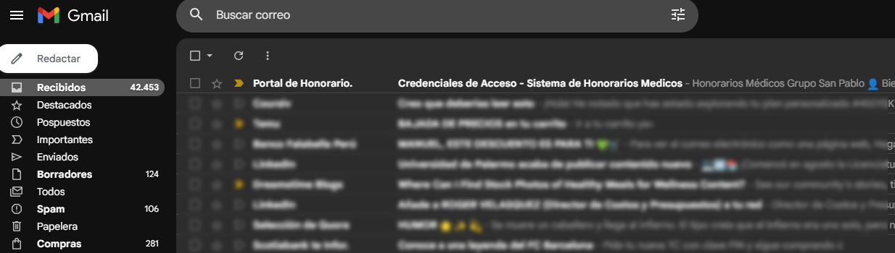

*Figura 1: Bandeja de correo*

### Contenido del correo

---

**Asunto:** Bienvenido al Sistema – Portal de Honorarios Médicos

**Encabezado:** Honorarios Médicos / Grupo San Pablo

**Cuerpo:**

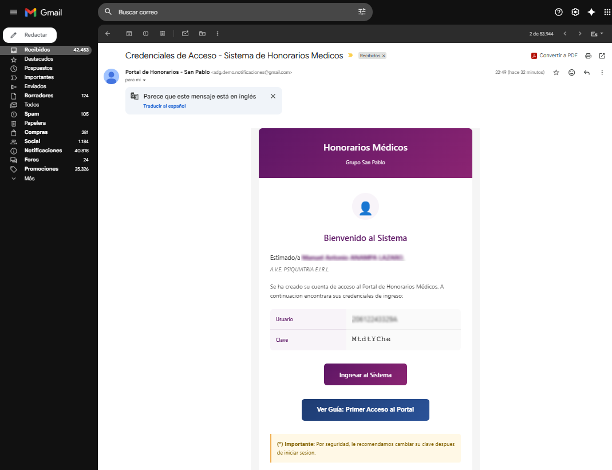

*Figura 2: Detalle de notificación*

---

> **Si el correo no llega:** Revisar la carpeta de **spam o correo no deseado**. Si persiste el problema, contactar al administrador para que reenvíe las credenciales.

### Características de la contraseña temporal

- Longitud: **8 caracteres** alfanuméricos
- Generada automáticamente por el sistema
- El sistema **obliga a cambiarla** en el primer acceso al portal

---

## Paso 2 – Ingresar al Portal

Acceder a la URL del Portal de Compañías Médicas proporcionada en el correo de bienvenida o facilitada por el administrador.

### Pantalla de inicio de sesión

La pantalla de login muestra dos columnas:
- **Izquierda:** Información del portal
- **Derecha:** Formulario de acceso

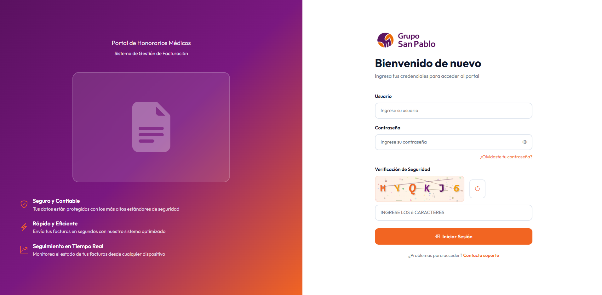

*Figura 3: Pantalla de inicio de sesión*

### Campos a completar

| Campo | Qué ingresar |
|-------|-------------|
| **Usuario** | El login recibido en el correo de bienvenida |
| **Contraseña** | La clave temporal recibida en el correo de bienvenida |
| **Verificación de Seguridad** | Los 6 caracteres que aparecen en la imagen CAPTCHA |

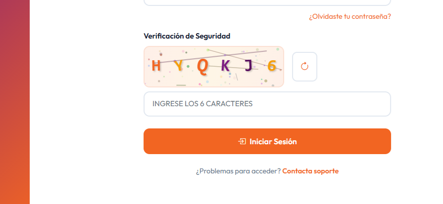

*Figura 4: Código de verificación CAPTCHA*

> **Sobre el CAPTCHA:**
> - El código usa letras y números (no incluye caracteres como `0`, `O`, `1`, `I` para evitar confusión)
> - Si no se puede leer con claridad, hacer clic en el ícono circular (⟳) para generar un nuevo código
> - El código no distingue entre mayúsculas y minúsculas

Hacer clic en **"Iniciar Sesión"**.

### Redirección automática

Al ser la primera vez que ingresa con contraseña temporal, el sistema lo redirige automáticamente a la pantalla **"Cambiar Contraseña"**.

> Este paso **no puede omitirse**. Debe establecer una nueva contraseña para acceder al portal.

---

## Paso 3 – Cambio de Contraseña Obligatorio

### Pantalla de cambio de contraseña

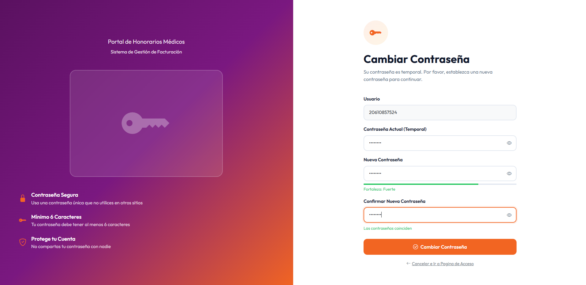

*Figura 5: Pantalla de cambio de contraseña temporal*

La pantalla muestra el mensaje:

> *"Su contraseña es temporal. Por favor, establezca una nueva contraseña para continuar."*

### Campos del formulario

| Campo | Descripción |
|-------|-------------|
| **Usuario** | Su login (solo lectura, no editable) |
| **Contraseña Actual (Temporal)** | La clave temporal del correo de bienvenida |
| **Nueva Contraseña** | La nueva contraseña que desea establecer |
| **Confirmar Nueva Contraseña** | Repetir la nueva contraseña |

> Usar el ícono del ojo (👁) junto a cada campo para mostrar u ocultar la contraseña mientras la escribe.

### Requisitos de la nueva contraseña

- **Longitud mínima:** 6 caracteres
- Se recomienda combinar letras mayúsculas, minúsculas, números y caracteres especiales

El sistema muestra un **indicador de fortaleza** en tiempo real mientras escribe:

| Indicador | Color | Descripción |
|-----------|-------|-------------|
| Muy débil | Rojo | Contraseña demasiado simple o corta |
| Débil | Naranja | Cumple el mínimo pero es predecible |
| Media | Azul | Combinación aceptable |
| Fuerte | Verde | Combinación sólida recomendada |

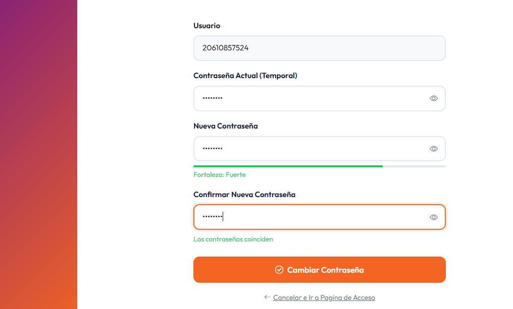

*Figura 6: Indicador de fortaleza y coincidencia de contraseñas*

El sistema también confirma en tiempo real si las contraseñas coinciden:
- **"Las contraseñas coinciden"** (verde) ✔
- **"Las contraseñas no coinciden"** (rojo) ✗

### Confirmar el cambio

Hacer clic en **"Cambiar Contraseña"**.

Si el proceso es exitoso, el sistema lo redirige al **Dashboard** del portal.

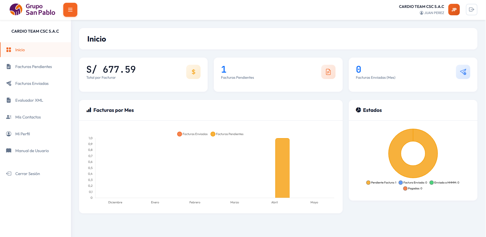

*Figura 7: Dashboard tras el primer ingreso exitoso*

### Errores posibles

| Mensaje | Causa | Solución |
|---------|-------|----------|
| *"La contraseña actual es incorrecta"* | Se ingresó mal la clave temporal | Verificar la clave en el correo de bienvenida |
| *"La nueva contraseña debe tener al menos 6 caracteres"* | Contraseña muy corta | Ingresar al menos 6 caracteres |
| *"Las contraseñas no coinciden"* | Los campos nueva contraseña y confirmación difieren | Escribir exactamente lo mismo en ambos campos |

### ¿Olvidó la contraseña temporal?

Si no encuentra el correo de bienvenida o la clave ya no funciona:

1. Contactar al administrador del sistema
2. El administrador generará una nueva clave temporal y la enviará por correo
3. Repetir el proceso de cambio de contraseña en el siguiente ingreso

---

## Paso 4 – Registrar Contactos de Notificación

Una vez dentro del portal, es importante registrar los **contactos de notificación** de su compañía. El Sistema de Honorarios Médicos envía notificaciones automáticas (avisos de producción, cambios de estado de facturas, comunicados) a los correos de estos contactos.

> **Regla principal:** Solo los contactos con estado **Activo** reciben notificaciones.

### Acceder al módulo de Contactos

En el menú lateral, seleccionar **"Mis Contactos"**.

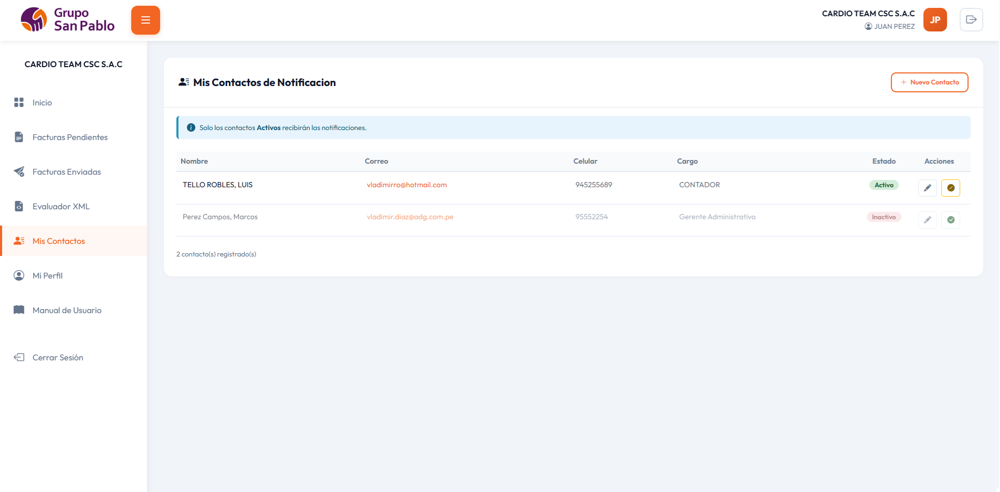

*Figura 8: Pantalla de contactos registrados*

### Registrar un nuevo contacto

Hacer clic en **"+ Nuevo Contacto"**.

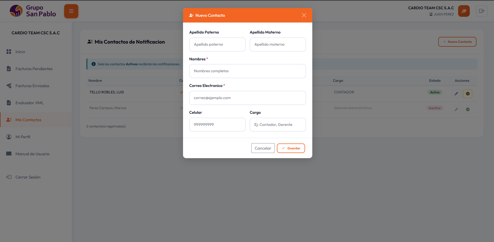

*Figura 9: Formulario de nuevo contacto*

Completar los campos:

| Campo | Obligatorio | Descripción |
|-------|:-----------:|-------------|
| **Nombres** | Sí | Nombre(s) completos del contacto |
| **Apellido Paterno** | No | Primer apellido |
| **Apellido Materno** | No | Segundo apellido |
| **Correo Electrónico** | Sí | Dirección donde recibirá las notificaciones |
| **Celular** | No | Número de celular (hasta 10 dígitos) |
| **Cargo** | No | Puesto en la compañía (ej.: Contador, Gerente) |

Hacer clic en **"Guardar"**. El contacto queda registrado en estado **Activo** por defecto.

### Lista de contactos

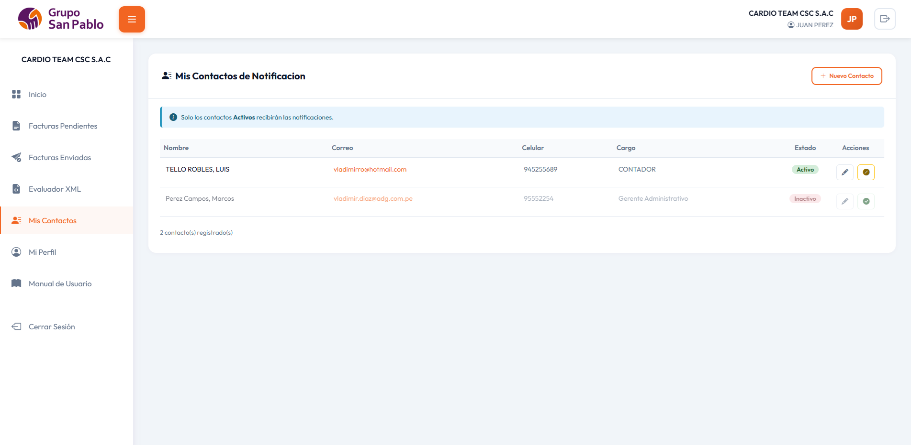

*Figura 10: Lista de contactos con estados activo e inactivo*

La tabla muestra:

| Columna | Descripción |
|---------|-------------|
| **Nombre** | Nombre completo del contacto |
| **Correo** | Dirección de email |
| **Celular** | Número o `-` si no se registró |
| **Cargo** | Puesto en la compañía |
| **Estado** | **Activo** (verde) / **Inactivo** (rojo) |
| **Acciones** | Editar / Activar o Inactivar |

Los contactos inactivos se muestran con opacidad reducida.

### Editar un contacto

Hacer clic en el ícono de **lápiz** (✏) en la fila del contacto.

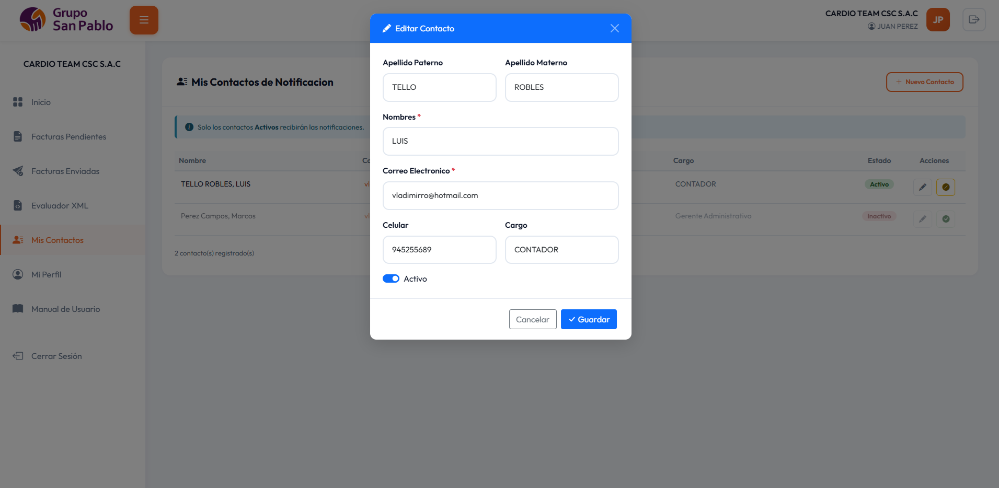

*Figura 11: Formulario de edición con interruptor de estado*

Se abre el formulario de edición con los mismos campos. Incluye además el interruptor **"Activo"** para cambiar el estado del contacto directamente desde aquí.

### Activar o inactivar un contacto

Desde la tabla, el segundo botón de acciones cambia el estado:

| Estado actual | Botón | Resultado |
|---------------|-------|-----------|
| **Activo** | Ícono barra (🚫) | El contacto deja de recibir notificaciones |
| **Inactivo** | Ícono check (✔) | El contacto vuelve a recibir notificaciones |

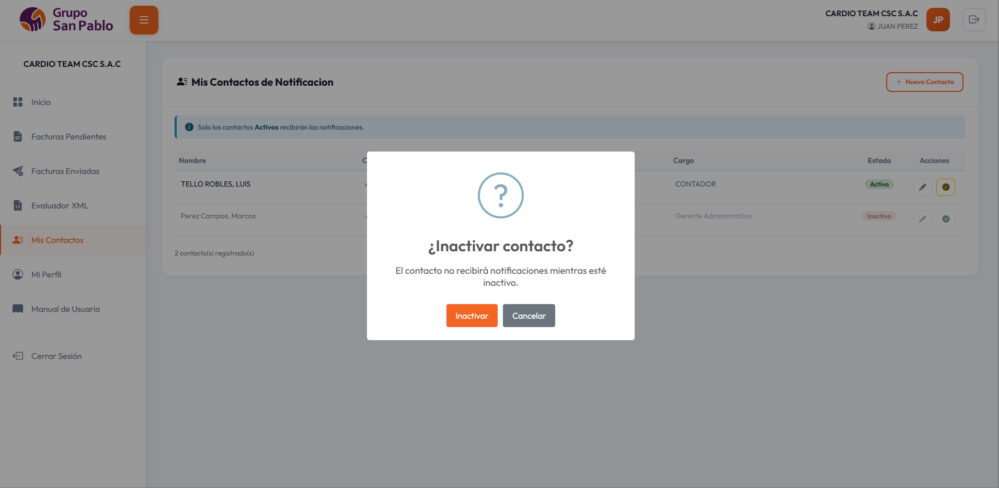

*Figura 12: Confirmación al inactivar un contacto*

El sistema pide confirmación antes de aplicar el cambio.

### Recomendaciones

- Registrar al menos **un contacto activo** para garantizar la recepción de notificaciones.
- Mantener los correos **actualizados**. Cuando cambie el responsable, inactivar el contacto anterior y crear uno nuevo.
- El correo del **usuario del portal** (perfil) y los correos de **contactos** son independientes; ambos pueden recibir notificaciones según la configuración del sistema.
- **Inactivar** contactos en lugar de eliminarlos para conservar el historial.

---

*Documento elaborado por el equipo de desarrollo ADG – Sistema SHM*
*Versión 1.1 – Mayo 2026*
