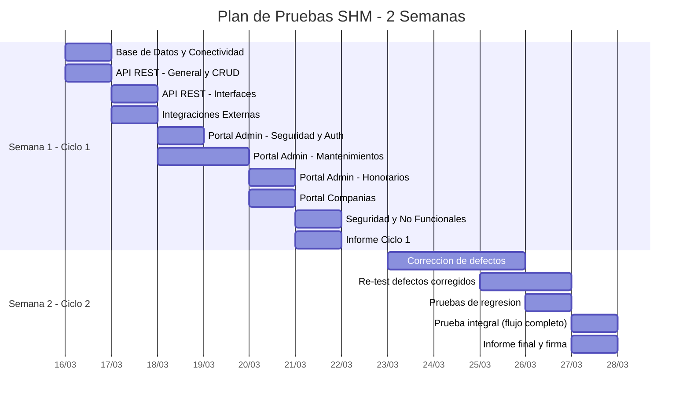

# Plan de Pruebas - SHM (Sistema de Honorarios Medicos)

---

## Informacion del Proyecto

<table>
<tr>
<td width="50%" align="center">


**Cliente**

**Complejo Hospitalario San Pablo**

</td>
<td width="50%" align="center">


**Desarrollado por**

**ADG Systems**

</td>
</tr>
</table>

| Atributo | Valor |
|----------|-------|
| **Proyecto** | Gestion de Honorarios Medicos |
| **Documento** | Plan de Pruebas |
| **Cliente** | Complejo Hospitalario San Pablo |
| **Desarrollador** | ADG Systems |
| **Version** | 1.0 |
| **Fecha** | Marzo 2026 |

---

## 1. Objetivo

Validar el correcto funcionamiento del Sistema de Honorarios Medicos (SHM) en todos sus componentes antes del pase a produccion, asegurando que los modulos funcionales, integraciones externas y requisitos no funcionales operan segun lo esperado.

---

## 2. Alcance

| Componente | Incluido | Observacion |
|-----------|----------|-------------|
| API REST (SHM.AppApiHonorarioMedico) | Si | Endpoints CRUD e interfaces |
| Portal Administrativo (SHM.AppWebHonorarioMedico) | Si | Todos los modulos |
| Portal Companias Medicas (SHM.AppWebCompaniaMedica) | Si | Todos los modulos |
| Base de Datos Oracle | Si | Estructura, datos maestros, integridad |
| Integracion API San Pablo HHMM | Si | Sedes, entidades, comprobantes |
| Integracion API SAP OData | Si | Bancos |
| Servicio SMTP | Si | Envio de correos |
| Carpeta compartida D:\SHM | Si | Lectura/escritura de archivos |

---

## 3. Tipos de Pruebas

| Tipo | Descripcion |
|------|-------------|
| Funcionales | Validar que cada modulo cumple los requisitos funcionales |
| Integracion | Verificar comunicacion entre componentes y sistemas externos |
| Seguridad | Autenticacion, autorizacion, proteccion de datos |
| No funcionales | Rendimiento basico, disponibilidad, logs |

---

## 4. Ambiente de Pruebas

| Recurso | Detalle |
|---------|---------|
| Servidor de aplicaciones | 192.1.0.173 (Windows Server / IIS) |
| Base de datos | Oracle 11g - 192.1.0.191:1521 |
| API San Pablo HHMM | apiintt.sanpablo.com.pe:23021 |
| API SAP OData | 190.12.87.190:8124 |
| SMTP | smtp.gmail.com:587 |
| Navegadores | Chrome (ultima version), Edge (ultima version) |

### Usuarios de prueba

| Usuario | Password | Tipo | Portal | Rol |
|---------|----------|------|--------|-----|
| SYSADMIN | 123456 | Interno | Portal Admin | Administrador del Sistema |
| (usuario compania) | (asignado) | Externo | Portal Companias | Compania Medica |

---

## 5. Casos de Prueba

### 5.1 Base de Datos

| # | Caso de Prueba | Pasos | Resultado Esperado | Estado |
|---|---------------|-------|-------------------|--------|
| BD-01 | Verificar estructura de tablas | Ejecutar: `SELECT table_name FROM user_tables WHERE table_name LIKE 'SHM_%'` | Se listan todas las tablas del sistema | [ ] |
| BD-02 | Verificar secuencias | Ejecutar: `SELECT sequence_name FROM user_sequences WHERE sequence_name LIKE 'SHM_%'` | Se listan todas las secuencias | [ ] |
| BD-03 | Verificar vistas | Ejecutar: `SELECT view_name FROM user_views WHERE view_name LIKE 'SHM_%'` | Vista SHM_TABLA_DETALLE_VW existe | [ ] |
| BD-04 | Verificar indices | Ejecutar: `SELECT index_name FROM user_indexes WHERE index_name LIKE 'SHM_%'` | Indices unicos creados | [ ] |
| BD-05 | Verificar datos maestros | Ejecutar: `SELECT COUNT(*) FROM SHM_TABLA` y `SELECT COUNT(*) FROM SHM_TABLA_DETALLE` | Tablas maestras con datos | [ ] |
| BD-06 | Verificar usuario SYSADMIN | Ejecutar: `SELECT LOGIN, ACTIVO FROM SHM_SEG_USUARIO WHERE LOGIN = 'SYSADMIN'` | Usuario existe y ACTIVO = 1 | [ ] |
| BD-07 | Verificar opciones de menu | Ejecutar: `SELECT COUNT(*) FROM SHM_SEG_OPCION WHERE ACTIVO = 1` | Opciones de menu cargadas | [ ] |
| BD-08 | Verificar conexion desde servidor | Probar conexion desde servidor de aplicaciones con TNSPing o sqlplus | Conexion exitosa | [ ] |

---

### 5.2 API REST (SHM.AppApiHonorarioMedico)

#### 5.2.1 Verificacion general

| # | Caso de Prueba | Metodo / URL | Resultado Esperado | Estado |
|---|---------------|-------------|-------------------|--------|
| API-01 | Health check | `GET /health` | Status 200, JSON `"Healthy"` | [ ] |
| API-02 | Swagger accesible | `GET /swagger` | Pagina Swagger UI carga correctamente | [ ] |
| API-03 | Endpoint de prueba | `GET /api/ProduccionInterface/test` | Status 200, JSON con fecha del servidor | [ ] |

#### 5.2.2 CRUD Endpoints

| # | Caso de Prueba | Metodo / URL | Resultado Esperado | Estado |
|---|---------------|-------------|-------------------|--------|
| API-04 | Listar usuarios | `GET /api/Usuarios` | Status 200, lista de usuarios | [ ] |
| API-05 | Listar roles | `GET /api/Roles` | Status 200, lista de roles | [ ] |
| API-06 | Listar sedes | `GET /api/Sedes` | Status 200, lista de sedes | [ ] |
| API-07 | Listar entidades medicas | `GET /api/EntidadesMedicas` | Status 200, lista de entidades | [ ] |
| API-08 | Listar bancos | `GET /api/Bancos` | Status 200, lista de bancos | [ ] |
| API-09 | Listar producciones | `GET /api/Producciones` | Status 200, lista de producciones | [ ] |
| API-10 | Listar tablas maestras | `GET /api/Tablas` | Status 200, lista de tablas | [ ] |
| API-11 | Listar parametros | `GET /api/Parametros` | Status 200, lista de parametros | [ ] |
| API-12 | Listar archivos | `GET /api/Archivos` | Status 200, lista de archivos | [ ] |
| API-13 | Listar bitacoras | `GET /api/Bitacoras` | Status 200, lista de bitacoras | [ ] |

#### 5.2.3 Interfaces de integracion

| # | Caso de Prueba | Metodo / URL | Resultado Esperado | Estado |
|---|---------------|-------------|-------------------|--------|
| API-14 | Recibir produccion | `POST /api/ProduccionInterface/producciones` | Status 200, produccion registrada en BD | [ ] |
| API-15 | Recibir liquidacion | `POST /api/ProduccionInterface/liquidaciones` | Status 200, liquidacion procesada | [ ] |
| API-16 | Sincronizar sedes | `POST /api/SedeInterface/sync` | Status 200, sedes sincronizadas desde API San Pablo | [ ] |
| API-17 | Sincronizar bancos | `POST /api/SapInterface/sincronizar-bancos` | Status 200, bancos sincronizados desde SAP | [ ] |

---

### 5.3 Portal Administrativo (SHM.AppWebHonorarioMedico)

#### 5.3.1 Autenticacion

| # | Caso de Prueba | Pasos | Resultado Esperado | Estado |
|---|---------------|-------|-------------------|--------|
| ADM-01 | Login exitoso | Ingresar SYSADMIN / 123456 | Redirige al Dashboard | [ ] |
| ADM-02 | Login fallido | Ingresar credenciales incorrectas | Muestra mensaje de error (SweetAlert) | [ ] |
| ADM-03 | Login campos vacios | Dejar usuario o password vacio y enviar | Muestra validacion de campos requeridos | [ ] |
| ADM-04 | Cerrar sesion | Click en "Cerrar Sesion" | Redirige a pagina de login | [ ] |
| ADM-05 | Sesion expirada | Esperar 30 minutos sin actividad | Al navegar, redirige a login | [ ] |
| ADM-06 | Acceso sin sesion | Navegar a URL interna sin estar autenticado | Redirige a login | [ ] |

#### 5.3.2 Dashboard

| # | Caso de Prueba | Pasos | Resultado Esperado | Estado |
|---|---------------|-------|-------------------|--------|
| ADM-07 | Visualizar dashboard | Login exitoso | Dashboard muestra indicadores y graficos | [ ] |
| ADM-08 | Menu de navegacion | Verificar opciones del menu lateral | Todas las opciones del menu se muestran segun el rol | [ ] |

#### 5.3.3 Gestion de Usuarios

| # | Caso de Prueba | Pasos | Resultado Esperado | Estado |
|---|---------------|-------|-------------------|--------|
| ADM-09 | Listar usuarios | Ir a Mantenimiento > Usuarios | Lista de usuarios con paginacion (DataTables) | [ ] |
| ADM-10 | Crear usuario interno | Click "Nuevo", llenar formulario, guardar | Usuario creado, aparece en la lista | [ ] |
| ADM-11 | Crear usuario externo | Click "Nuevo", tipo Externo, asociar entidad, guardar | Usuario creado con entidad medica asociada | [ ] |
| ADM-12 | Editar usuario | Seleccionar usuario, modificar datos, guardar | Datos actualizados correctamente | [ ] |
| ADM-13 | Eliminar usuario | Seleccionar usuario, click eliminar, confirmar | Usuario desactivado (soft delete), no aparece en lista | [ ] |
| ADM-14 | Validar campos requeridos | Intentar guardar con campos vacios | Muestra alerta con campos faltantes | [ ] |
| ADM-15 | Validar email duplicado | Crear usuario con email ya existente | Muestra mensaje de error | [ ] |
| ADM-16 | Buscar usuario | Usar campo de busqueda en DataTable | Filtra resultados correctamente | [ ] |

#### 5.3.4 Gestion de Roles

| # | Caso de Prueba | Pasos | Resultado Esperado | Estado |
|---|---------------|-------|-------------------|--------|
| ADM-17 | Listar roles | Ir a Mantenimiento > Roles | Lista de roles activos | [ ] |
| ADM-18 | Crear rol | Click "Nuevo", ingresar nombre y descripcion, guardar | Rol creado exitosamente | [ ] |
| ADM-19 | Editar rol | Seleccionar rol, modificar datos, guardar | Datos actualizados | [ ] |
| ADM-20 | Eliminar rol | Seleccionar rol, eliminar, confirmar | Rol desactivado (soft delete) | [ ] |
| ADM-21 | Asignar opciones a rol | Editar rol, marcar opciones de menu, guardar | Opciones asignadas correctamente | [ ] |

#### 5.3.5 Gestion de Opciones de Menu

| # | Caso de Prueba | Pasos | Resultado Esperado | Estado |
|---|---------------|-------|-------------------|--------|
| ADM-22 | Listar opciones | Ir a Mantenimiento > Opciones | Lista de opciones en estructura jerarquica | [ ] |
| ADM-23 | Crear opcion | Click "Nuevo", llenar datos (nombre, URL, icono, orden), guardar | Opcion creada | [ ] |
| ADM-24 | Editar opcion | Seleccionar opcion, modificar, guardar | Datos actualizados | [ ] |
| ADM-25 | Eliminar opcion | Seleccionar opcion, eliminar, confirmar | Opcion desactivada | [ ] |

#### 5.3.6 Gestion de Sedes

| # | Caso de Prueba | Pasos | Resultado Esperado | Estado |
|---|---------------|-------|-------------------|--------|
| ADM-26 | Listar sedes | Ir a Mantenimiento > Sedes | Lista de sedes con codigo, nombre, RUC | [ ] |
| ADM-27 | Ver detalle sede | Click en una sede | Muestra datos completos de la sede | [ ] |
| ADM-28 | Editar sede | Modificar datos de la sede, guardar | Datos actualizados | [ ] |

#### 5.3.7 Gestion de Entidades Medicas

| # | Caso de Prueba | Pasos | Resultado Esperado | Estado |
|---|---------------|-------|-------------------|--------|
| ADM-29 | Listar entidades | Ir a Mantenimiento > Entidades Medicas | Lista de entidades medicas | [ ] |
| ADM-30 | Crear entidad | Click "Nuevo", llenar datos (razon social, RUC, tipo), guardar | Entidad creada | [ ] |
| ADM-31 | Editar entidad | Seleccionar entidad, modificar, guardar | Datos actualizados | [ ] |
| ADM-32 | Eliminar entidad | Seleccionar entidad, eliminar, confirmar | Entidad desactivada | [ ] |
| ADM-33 | Gestionar cuentas bancarias | En detalle de entidad, agregar cuenta bancaria | Cuenta asociada correctamente | [ ] |

#### 5.3.8 Gestion de Bancos

| # | Caso de Prueba | Pasos | Resultado Esperado | Estado |
|---|---------------|-------|-------------------|--------|
| ADM-34 | Listar bancos | Ir a Mantenimiento > Bancos | Lista de bancos con codigo y nombre | [ ] |
| ADM-35 | Crear banco | Click "Nuevo", ingresar codigo y nombre, guardar | Banco creado | [ ] |
| ADM-36 | Editar banco | Seleccionar banco, modificar, guardar | Datos actualizados | [ ] |

#### 5.3.9 Tablas Maestras y Parametros

| # | Caso de Prueba | Pasos | Resultado Esperado | Estado |
|---|---------------|-------|-------------------|--------|
| ADM-37 | Listar tablas detalle | Ir a Mantenimiento > Tablas Detalle | Lista de valores por tabla maestra | [ ] |
| ADM-38 | Crear detalle | Seleccionar tabla, agregar nuevo valor | Valor creado | [ ] |
| ADM-39 | Listar parametros | Ir a Mantenimiento > Parametros | Lista de parametros del sistema | [ ] |
| ADM-40 | Editar parametro | Seleccionar parametro, modificar valor, guardar | Parametro actualizado | [ ] |

#### 5.3.10 Produccion

| # | Caso de Prueba | Pasos | Resultado Esperado | Estado |
|---|---------------|-------|-------------------|--------|
| ADM-41 | Listar produccion | Ir a Honorarios > Produccion | Lista de produccion con filtros por periodo y sede | [ ] |
| ADM-42 | Filtrar por periodo | Seleccionar periodo en filtro | Lista filtrada por periodo seleccionado | [ ] |
| ADM-43 | Filtrar por sede | Seleccionar sede en filtro | Lista filtrada por sede seleccionada | [ ] |
| ADM-44 | Ver detalle produccion | Click en una produccion | Muestra informacion completa del registro | [ ] |

#### 5.3.11 Liquidacion

| # | Caso de Prueba | Pasos | Resultado Esperado | Estado |
|---|---------------|-------|-------------------|--------|
| ADM-45 | Listar liquidaciones | Ir a Honorarios > Liquidacion | Lista de liquidaciones | [ ] |
| ADM-46 | Ver detalle liquidacion | Click en una liquidacion | Muestra informacion completa | [ ] |

#### 5.3.12 Archivos / Comprobantes

| # | Caso de Prueba | Pasos | Resultado Esperado | Estado |
|---|---------------|-------|-------------------|--------|
| ADM-47 | Listar archivos | Ir a Honorarios > Archivos | Lista de archivos registrados | [ ] |
| ADM-48 | Ver comprobante PDF | Click en archivo PDF | Visualiza o descarga el PDF desde D:\SHM | [ ] |
| ADM-49 | Ver comprobante XML | Click en archivo XML | Visualiza o descarga el XML desde D:\SHM | [ ] |

#### 5.3.13 Ordenes de Pago

| # | Caso de Prueba | Pasos | Resultado Esperado | Estado |
|---|---------------|-------|-------------------|--------|
| ADM-50 | Listar ordenes de pago | Ir a Honorarios > Ordenes de Pago | Lista de ordenes de pago | [ ] |
| ADM-51 | Crear orden de pago | Seleccionar producciones, generar orden | Orden creada con estado inicial | [ ] |
| ADM-52 | Ver detalle orden | Click en una orden | Muestra detalle con producciones asociadas | [ ] |

#### 5.3.14 Aprobacion de Ordenes de Pago

| # | Caso de Prueba | Pasos | Resultado Esperado | Estado |
|---|---------------|-------|-------------------|--------|
| ADM-53 | Listar ordenes pendientes | Ir a Honorarios > Aprobacion | Lista de ordenes pendientes de aprobacion | [ ] |
| ADM-54 | Aprobar orden | Seleccionar orden, click aprobar, confirmar | Orden cambia de estado a aprobada | [ ] |
| ADM-55 | Rechazar orden | Seleccionar orden, click rechazar, ingresar motivo | Orden cambia de estado a rechazada | [ ] |

#### 5.3.15 Perfil de Aprobacion

| # | Caso de Prueba | Pasos | Resultado Esperado | Estado |
|---|---------------|-------|-------------------|--------|
| ADM-56 | Listar perfiles | Ir a Mantenimiento > Perfiles de Aprobacion | Lista de perfiles configurados | [ ] |
| ADM-57 | Crear perfil | Click "Nuevo", configurar niveles y aprobadores, guardar | Perfil creado | [ ] |
| ADM-58 | Editar perfil | Seleccionar perfil, modificar, guardar | Perfil actualizado | [ ] |

---

### 5.4 Portal Companias Medicas (SHM.AppWebCompaniaMedica)

#### 5.4.1 Autenticacion

| # | Caso de Prueba | Pasos | Resultado Esperado | Estado |
|---|---------------|-------|-------------------|--------|
| CIA-01 | Login exitoso | Ingresar credenciales de compania | Redirige al Dashboard | [ ] |
| CIA-02 | Login fallido | Ingresar credenciales incorrectas | Muestra mensaje de error | [ ] |
| CIA-03 | Login campos vacios | Dejar campos vacios y enviar | Muestra validacion de campos requeridos | [ ] |
| CIA-04 | Cerrar sesion | Click en "Cerrar Sesion" | Redirige a pagina de login | [ ] |
| CIA-05 | Sesion expirada | Esperar 30 minutos sin actividad | Al navegar, redirige a login | [ ] |
| CIA-06 | Acceso sin sesion | Navegar a URL interna sin estar autenticado | Redirige a login | [ ] |

#### 5.4.2 Dashboard

| # | Caso de Prueba | Pasos | Resultado Esperado | Estado |
|---|---------------|-------|-------------------|--------|
| CIA-07 | Visualizar dashboard | Login exitoso | Dashboard muestra resumen de la compania | [ ] |

#### 5.4.3 Consulta de Produccion (Facturas)

| # | Caso de Prueba | Pasos | Resultado Esperado | Estado |
|---|---------------|-------|-------------------|--------|
| CIA-08 | Listar produccion | Ir a Facturas | Lista de produccion de la compania logueada | [ ] |
| CIA-09 | Filtrar por periodo | Seleccionar periodo | Resultados filtrados por periodo | [ ] |
| CIA-10 | Filtrar por sede | Seleccionar sede | Resultados filtrados por sede | [ ] |
| CIA-11 | Ver detalle | Click en un registro | Muestra detalle de la produccion | [ ] |
| CIA-12 | Solo ve su data | Verificar que solo muestra produccion de su entidad | No se visualiza produccion de otras entidades | [ ] |

#### 5.4.4 Registro de Comprobantes

| # | Caso de Prueba | Pasos | Resultado Esperado | Estado |
|---|---------------|-------|-------------------|--------|
| CIA-13 | Registrar comprobante | Seleccionar produccion, ingresar datos del comprobante | Comprobante registrado exitosamente | [ ] |
| CIA-14 | Cargar archivo PDF | Adjuntar archivo PDF al comprobante | PDF guardado en D:\SHM, registro en BD | [ ] |
| CIA-15 | Cargar archivo XML | Adjuntar archivo XML al comprobante | XML guardado en D:\SHM, registro en BD | [ ] |
| CIA-16 | Validar tipo archivo | Intentar cargar archivo no permitido (.exe, .bat) | Rechaza el archivo con mensaje de error | [ ] |
| CIA-17 | Validar campos requeridos | Intentar registrar sin datos obligatorios | Muestra alerta con campos faltantes | [ ] |
| CIA-18 | Enviar comprobante a HHMM | Registrar comprobante con envio a San Pablo | Comprobante enviado a API HHMM, respuesta exitosa | [ ] |

#### 5.4.5 Gestion de Usuarios (Compania)

| # | Caso de Prueba | Pasos | Resultado Esperado | Estado |
|---|---------------|-------|-------------------|--------|
| CIA-19 | Ver perfil | Ir a mi perfil | Muestra datos del usuario logueado | [ ] |
| CIA-20 | Cambiar password | Modificar password desde perfil | Password actualizado (hash BCrypt) | [ ] |

---

### 5.5 Integraciones Externas

#### 5.5.1 API San Pablo HHMM

| # | Caso de Prueba | Pasos | Resultado Esperado | Estado |
|---|---------------|-------|-------------------|--------|
| INT-01 | Autenticacion JWT | Ejecutar endpoint de login | Token JWT obtenido correctamente | [ ] |
| INT-02 | Obtener sedes | Ejecutar sincronizacion de sedes | Sedes obtenidas y registradas/actualizadas en BD | [ ] |
| INT-03 | Obtener entidades | Ejecutar sincronizacion de entidades | Entidades obtenidas y registradas/actualizadas en BD | [ ] |
| INT-04 | Registrar comprobante | Enviar comprobante desde Portal Companias | Comprobante registrado en sistema HHMM | [ ] |
| INT-05 | Token expirado | Simular token expirado, realizar peticion | Sistema renueva token automaticamente | [ ] |
| INT-06 | API no disponible | Simular caida de API San Pablo | Muestra mensaje de error controlado, registra en log | [ ] |

#### 5.5.2 API SAP OData

| # | Caso de Prueba | Pasos | Resultado Esperado | Estado |
|---|---------------|-------|-------------------|--------|
| INT-07 | Autenticacion OAuth2 | Ejecutar obtencion de token SAP | Token obtenido con client_credentials | [ ] |
| INT-08 | Obtener bancos | Ejecutar sincronizacion de bancos | Bancos obtenidos y registrados en BD | [ ] |
| INT-09 | Token expirado | Simular token expirado, realizar peticion | Sistema renueva token (invalida cache) | [ ] |
| INT-10 | SAP no disponible | Simular caida de SAP | Muestra mensaje de error controlado, registra en log | [ ] |

#### 5.5.3 Servicio SMTP

| # | Caso de Prueba | Pasos | Resultado Esperado | Estado |
|---|---------------|-------|-------------------|--------|
| INT-11 | Enviar correo | Ejecutar accion que dispare notificacion | Correo recibido por destinatario | [ ] |
| INT-12 | SMTP no disponible | Simular caida de SMTP | Operacion principal no se bloquea, error en log | [ ] |

#### 5.5.4 Carpeta Compartida D:\SHM

| # | Caso de Prueba | Pasos | Resultado Esperado | Estado |
|---|---------------|-------|-------------------|--------|
| INT-13 | Escritura desde Portal Companias | Cargar PDF desde Portal Companias | Archivo guardado en D:\SHM | [ ] |
| INT-14 | Lectura desde Portal Admin | Ver comprobante desde Portal Admin | Archivo se visualiza/descarga correctamente | [ ] |
| INT-15 | Permisos de carpeta | Verificar que shm_api_pool NO puede escribir en D:\SHM | Acceso denegado para API Pool | [ ] |

---

### 5.6 Seguridad

| # | Caso de Prueba | Pasos | Resultado Esperado | Estado |
|---|---------------|-------|-------------------|--------|
| SEG-01 | GUID en URLs | Navegar a detalle de un registro | URL contiene GUID, no ID numerico | [ ] |
| SEG-02 | Acceso con GUID invalido | Ingresar GUID inexistente en URL | Muestra pagina de error o redirige | [ ] |
| SEG-03 | Password hasheado | Consultar SHM_SEG_USUARIO en BD | Columna PASSWORD contiene hash BCrypt (no texto plano) | [ ] |
| SEG-04 | Soft delete | Eliminar un registro y verificar en BD | Campo ACTIVO = 0, registro no eliminado fisicamente | [ ] |
| SEG-05 | Campos de auditoria | Crear/modificar registro y verificar en BD | ID_CREADOR, FECHA_CREACION, ID_MODIFICADOR, FECHA_MODIFICACION correctos | [ ] |
| SEG-06 | HTTPS obligatorio | Acceder por HTTP | Redirige a HTTPS o rechaza conexion | [ ] |
| SEG-07 | Acceso por rol | Login con usuario sin permisos a un modulo | Menu no muestra opciones no autorizadas | [ ] |
| SEG-08 | Portal Admin solo intranet | Acceder al Portal Admin desde red externa | Acceso denegado (firewall) | [ ] |
| SEG-09 | API protegida por red | Acceder al API REST desde red externa | Acceso denegado (firewall) | [ ] |
| SEG-10 | Portal Companias desde internet | Acceder al Portal Companias desde internet | Acceso permitido via HTTPS | [ ] |

---

### 5.7 No Funcionales

| # | Caso de Prueba | Pasos | Resultado Esperado | Estado |
|---|---------------|-------|-------------------|--------|
| NF-01 | Generacion de logs API | Ejecutar endpoints del API | Archivos de log generados en carpeta Logs/ | [ ] |
| NF-02 | Generacion de logs Portal Admin | Navegar por el Portal Admin | Archivos de log generados en carpeta Logs/ | [ ] |
| NF-03 | Generacion de logs Portal Companias | Navegar por el Portal Companias | Archivos de log generados en carpeta Logs/ | [ ] |
| NF-04 | Formato de log correcto | Revisar contenido de log | Formato: fecha\|nivel\|clase\|mensaje | [ ] |
| NF-05 | DataTables con paginacion | Abrir listados con mas de 10 registros | Paginacion funciona correctamente | [ ] |
| NF-06 | Select2 con busqueda | Usar combos con busqueda (sedes, entidades) | Busqueda y seleccion funcionan correctamente | [ ] |
| NF-07 | Responsive | Acceder desde dispositivo movil o redimensionar navegador | Interfaz se adapta al tamano de pantalla | [ ] |
| NF-08 | Certificado SSL valido | Verificar certificado en navegador | Candado verde, sin advertencias de seguridad | [ ] |
| NF-09 | Tiempo de carga de paginas | Navegar por las paginas principales | Paginas cargan en menos de 3 segundos | [ ] |
| NF-10 | IIS App Pools activos | Verificar en IIS Manager | Los 3 App Pools en estado Started | [ ] |

---

## 6. Matriz de Trazabilidad

| Modulo | Casos de Prueba | Cantidad |
|--------|----------------|----------|
| Base de Datos | BD-01 a BD-08 | 8 |
| API REST - General | API-01 a API-03 | 3 |
| API REST - CRUD | API-04 a API-13 | 10 |
| API REST - Interfaces | API-14 a API-17 | 4 |
| Portal Admin - Autenticacion | ADM-01 a ADM-06 | 6 |
| Portal Admin - Dashboard | ADM-07 a ADM-08 | 2 |
| Portal Admin - Usuarios | ADM-09 a ADM-16 | 8 |
| Portal Admin - Roles | ADM-17 a ADM-21 | 5 |
| Portal Admin - Opciones | ADM-22 a ADM-25 | 4 |
| Portal Admin - Sedes | ADM-26 a ADM-28 | 3 |
| Portal Admin - Entidades Medicas | ADM-29 a ADM-33 | 5 |
| Portal Admin - Bancos | ADM-34 a ADM-36 | 3 |
| Portal Admin - Tablas y Parametros | ADM-37 a ADM-40 | 4 |
| Portal Admin - Produccion | ADM-41 a ADM-44 | 4 |
| Portal Admin - Liquidacion | ADM-45 a ADM-46 | 2 |
| Portal Admin - Archivos | ADM-47 a ADM-49 | 3 |
| Portal Admin - Ordenes de Pago | ADM-50 a ADM-52 | 3 |
| Portal Admin - Aprobacion | ADM-53 a ADM-55 | 3 |
| Portal Admin - Perfiles | ADM-56 a ADM-58 | 3 |
| Portal Companias - Autenticacion | CIA-01 a CIA-06 | 6 |
| Portal Companias - Dashboard | CIA-07 | 1 |
| Portal Companias - Facturas | CIA-08 a CIA-12 | 5 |
| Portal Companias - Comprobantes | CIA-13 a CIA-18 | 6 |
| Portal Companias - Usuarios | CIA-19 a CIA-20 | 2 |
| Integracion - API San Pablo | INT-01 a INT-06 | 6 |
| Integracion - API SAP | INT-07 a INT-10 | 4 |
| Integracion - SMTP | INT-11 a INT-12 | 2 |
| Integracion - Carpeta Compartida | INT-13 a INT-15 | 3 |
| Seguridad | SEG-01 a SEG-10 | 10 |
| No Funcionales | NF-01 a NF-10 | 10 |
| **TOTAL** | | **138** |

---

## 7. Criterios de Aceptacion

### Para pase a produccion se requiere:

- **100%** de casos de Base de Datos aprobados (BD-01 a BD-08)
- **100%** de casos de Autenticacion aprobados (ADM-01 a ADM-06, CIA-01 a CIA-06)
- **100%** de casos de Seguridad aprobados (SEG-01 a SEG-10)
- **100%** de casos de Integracion aprobados (INT-01 a INT-15)
- **95%** o mas de casos funcionales aprobados (API, ADM, CIA)
- **90%** o mas de casos no funcionales aprobados (NF-01 a NF-10)
- **0** defectos criticos abiertos
- **0** defectos altos abiertos

### Clasificacion de defectos

| Severidad | Descripcion | Tiempo de resolucion |
|-----------|-------------|---------------------|
| Critico | Sistema no funciona, perdida de datos, falla de seguridad | Inmediato (bloquea pase) |
| Alto | Funcionalidad principal no opera correctamente | Antes del pase |
| Medio | Funcionalidad secundaria con problemas, workaround disponible | Puede pasar con plan de correccion |
| Bajo | Estetico, mejora menor | No bloquea pase |

---

## 8. Plan de Trabajo (2 Semanas)

### 8.1 Cronograma General

```
Semana 1: Ciclo 1 - Ejecucion de pruebas
Semana 2: Ciclo 2 - Correccion de defectos y re-test
```



### 8.2 Detalle Diario

#### Semana 1 — Ciclo 1: Ejecucion de Pruebas

| Dia | Fecha | Actividad | Casos | Cant. | Responsable |
|-----|-------|-----------|-------|-------|-------------|
| Lun | 16/03 | Base de Datos: estructura, datos, conexion | BD-01 a BD-08 | 8 | QA / DBA |
| Lun | 16/03 | API REST: health check, Swagger, CRUD endpoints | API-01 a API-13 | 13 | QA |
| Mar | 17/03 | API REST: interfaces de integracion | API-14 a API-17 | 4 | QA |
| Mar | 17/03 | Integraciones: San Pablo, SAP, SMTP, carpeta compartida | INT-01 a INT-15 | 15 | QA / Desarrollo |
| Mie | 18/03 | Portal Admin: autenticacion, dashboard, menu | ADM-01 a ADM-08 | 8 | QA |
| Mie | 18/03 | Portal Admin: usuarios, roles, opciones | ADM-09 a ADM-25 | 17 | QA |
| Jue | 19/03 | Portal Admin: sedes, entidades, bancos, tablas, parametros | ADM-26 a ADM-40 | 15 | QA |
| Vie | 20/03 | Portal Admin: produccion, liquidacion, archivos, ordenes, aprobacion, perfiles | ADM-41 a ADM-58 | 18 | QA |
| Vie | 20/03 | Portal Companias: auth, dashboard, facturas, comprobantes, usuarios | CIA-01 a CIA-20 | 20 | QA |
| Sab | 21/03 | Seguridad: GUID, hashing, soft delete, HTTPS, acceso por red | SEG-01 a SEG-10 | 10 | QA / Infra |
| Sab | 21/03 | No funcionales: logs, rendimiento, responsive, SSL | NF-01 a NF-10 | 10 | QA |
| Sab | 21/03 | **Elaboracion de Informe Ciclo 1** | -- | -- | QA |

**Total Semana 1:** 138 casos ejecutados

#### Semana 2 — Ciclo 2: Correccion y Re-test

| Dia | Fecha | Actividad | Detalle | Responsable |
|-----|-------|-----------|---------|-------------|
| Lun | 23/03 | Revision de defectos | Priorizar defectos por severidad, asignar responsables | QA / Desarrollo |
| Lun | 23/03 | Correccion de defectos criticos y altos | Desarrollo corrige defectos bloqueantes | Desarrollo |
| Mar | 24/03 | Correccion de defectos medios | Desarrollo corrige defectos medios | Desarrollo |
| Mie | 25/03 | Correccion de defectos restantes | Completar correcciones pendientes | Desarrollo |
| Mie | 25/03 | Re-test de defectos corregidos | Re-ejecutar casos fallidos del Ciclo 1 | QA |
| Jue | 26/03 | Re-test de defectos corregidos | Continuar re-test pendientes | QA |
| Jue | 26/03 | Pruebas de regresion | Verificar que correcciones no afectaron otros modulos | QA |
| Vie | 27/03 | Prueba integral (end-to-end) | Ejecutar flujo completo (ver 8.3) | QA |
| Vie | 27/03 | **Elaboracion de Informe Final** | Consolidar resultados, firma de aceptacion | QA / Jefe Proyecto |

### 8.3 Prueba Integral (End-to-End)

Ejecutar el flujo completo del negocio en un solo recorrido para validar la integracion de todos los componentes:

| Paso | Accion | Componente | Verificacion |
|------|--------|-----------|-------------|
| 1 | Sincronizar sedes desde API San Pablo | API REST | Sedes actualizadas en BD |
| 2 | Sincronizar bancos desde SAP | API REST | Bancos registrados en BD |
| 3 | Recibir produccion desde SAP | API REST | Produccion registrada en BD |
| 4 | Login en Portal Admin | Portal Admin | Dashboard muestra produccion recibida |
| 5 | Verificar produccion en listado | Portal Admin | Produccion visible con datos correctos |
| 6 | Login en Portal Companias | Portal Companias | Dashboard muestra produccion de la entidad |
| 7 | Registrar comprobante con PDF y XML | Portal Companias | Archivos guardados en D:\SHM, registro en BD |
| 8 | Enviar comprobante a HHMM | Portal Companias | Comprobante registrado en API San Pablo |
| 9 | Recibir liquidacion desde SAP | API REST | Liquidacion procesada en BD |
| 10 | Verificar liquidacion en Portal Admin | Portal Admin | Liquidacion visible con montos correctos |
| 11 | Visualizar comprobante PDF desde Portal Admin | Portal Admin | PDF se abre desde D:\SHM |
| 12 | Generar orden de pago | Portal Admin | Orden creada con estado inicial |
| 13 | Aprobar orden de pago | Portal Admin | Orden cambia a estado aprobada |
| 14 | Verificar correo de notificacion | Correo | Notificacion recibida por destinatario |
| 15 | Verificar logs generados | Servidor | Logs registrados en los 3 componentes |

### 8.4 Resumen de Esfuerzo

| Actividad | Dias | Responsable |
|-----------|------|-------------|
| Ejecucion Ciclo 1 (138 casos) | 6 | QA |
| Informe Ciclo 1 | 1 | QA |
| Correccion de defectos | 3 | Desarrollo |
| Re-test y regresion | 2 | QA |
| Prueba integral (E2E) | 1 | QA |
| Informe final y cierre | 1 | QA / Jefe Proyecto |
| **Total** | **10 dias habiles (2 semanas)** | |

### 8.5 Riesgos del Plan

| Riesgo | Impacto | Mitigacion |
|--------|---------|-----------|
| APIs externas no disponibles (San Pablo, SAP) | No se pueden ejecutar INT-01 a INT-10 | Coordinar ventana de pruebas con San Pablo y SAP |
| Cantidad de defectos criticos mayor a lo esperado | Semana 2 insuficiente para corregir | Priorizar defectos criticos, posponer medios/bajos |
| Falta de datos de prueba (produccion, entidades) | Casos funcionales incompletos | Preparar datos de prueba antes del inicio |
| Acceso a servidor de produccion no disponible | No se pueden validar pruebas de red/firewall | Coordinar acceso con infraestructura antes del inicio |

### 8.6 Prerequisitos para Iniciar

```
[ ] 1. Ambiente de pruebas desplegado (3 aplicaciones en IIS)
[ ] 2. Base de datos con scripts 00 a 07 ejecutados
[ ] 3. Datos de prueba cargados (sedes, entidades, usuarios)
[ ] 4. Credenciales de APIs externas configuradas (San Pablo, SAP)
[ ] 5. SMTP configurado y funcional
[ ] 6. Carpeta D:\SHM creada con permisos asignados
[ ] 7. Acceso de red verificado a todos los servicios externos
[ ] 8. Navegadores Chrome y Edge instalados en equipo de QA
[ ] 9. Acceso VPN / red interna para pruebas de seguridad de red
```

---

## 9. Registro de Ejecucion de Ciclos

| Ciclo | Fecha Inicio | Fecha Fin | Ejecutado por | Aprobados | Fallidos | Pendientes |
|-------|-------------|-----------|---------------|-----------|---------|------------|
| Ciclo 1 | -- | -- | -- | -- | -- | -- |
| Ciclo 2 | -- | -- | -- | -- | -- | -- |

---

## 9. Registro de Defectos

| # | Fecha | Caso | Severidad | Descripcion | Estado | Responsable | Fecha Resolucion |
|---|-------|------|-----------|-------------|--------|-------------|-----------------|
| 1 | -- | -- | -- | -- | -- | -- | -- |

---

*Documento generado: Marzo 2026*
