# Manual de Usuario
## Portal de Honorarios Médicos – Compañías Médicas
### SHM.AppWebCompaniaMedica

**Versión:** 1.0
**Fecha:** Abril 2026
**Cliente:** Grupo San Pablo

---

## Tabla de Contenidos

1. [Introducción](#1-introducción)
2. [Acceso al Sistema](#2-acceso-al-sistema)
3. [Dashboard](#3-dashboard)
4. [Facturas Pendientes](#4-facturas-pendientes)
5. [Subir Factura (Asistente de 4 pasos)](#5-subir-factura-asistente-de-4-pasos)
6. [Facturas Enviadas](#6-facturas-enviadas)
7. [Detalle de Factura](#7-detalle-de-factura)
8. [Mi Perfil](#8-mi-perfil)
9. [Herramientas – Evaluador de XML](#9-herramientas--evaluador-de-xml)
10. [Cerrar Sesión](#10-cerrar-sesión)
11. [Preguntas Frecuentes](#11-preguntas-frecuentes)
12. [Mensajes del Sistema](#12-mensajes-del-sistema)
13. [Soporte Técnico](#13-soporte-técnico)

---

## 1. Introducción

El **Portal de Honorarios Médicos para Compañías Médicas** es una plataforma web que permite gestionar comprobantes electrónicos de forma segura y trazable. A través de este portal usted puede:

- Visualizar las facturas pendientes de envío generadas por el sistema
- Enviar comprobantes electrónicos (PDF, XML y CDR) mediante un asistente guiado de 4 pasos
- Consultar el estado de las facturas ya enviadas
- Descargar los archivos adjuntos de cualquier comprobante
- Validar la estructura de un XML antes de enviarlo (Evaluador XML)
- Gestionar su información personal y cambiar su contraseña

### Requisitos del Sistema

| Requisito | Detalle |
|-----------|---------|
| Navegador | Chrome, Firefox, Edge o Safari (versión actualizada) |
| Conexión | Internet estable |
| Archivos | PDF y XML del comprobante electrónico emitido en SUNAT |
| CDR | Archivo CDR de SUNAT (según configuración del sistema) |

---

## 2. Acceso al Sistema

### 2.1 Pantalla de Inicio de Sesión

Ingrese a la URL proporcionada por el administrador del sistema. La pantalla de login se divide en dos secciones: información del portal (izquierda) y el formulario de acceso (derecha).

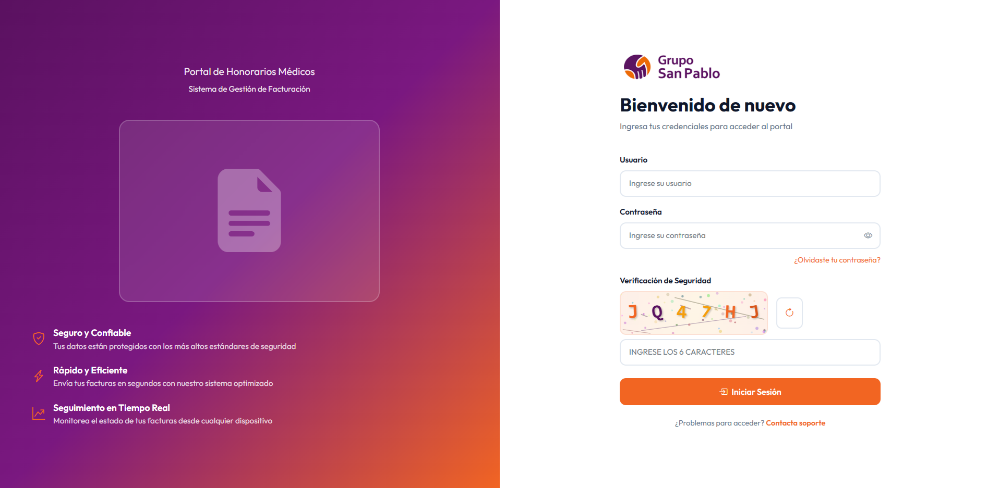

*Figura 2.1: Pantalla de inicio de sesión*

### 2.2 Campos de Acceso

| Campo | Descripción |
|-------|-------------|
| **Usuario** | Nombre de usuario asignado por el administrador |
| **Contraseña** | Su contraseña personal |
| **Código de Verificación** | Código CAPTCHA de 6 caracteres alfanuméricos |

### 2.3 Pasos para Iniciar Sesión

1. Ingrese su **usuario**
2. Ingrese su **contraseña** (use el ícono del ojo para mostrarla u ocultarla)
3. Copie los **6 caracteres** que aparecen en la imagen de verificación
   - Si no puede leer el código, haga clic en el botón de actualizar (ícono circular) para generar uno nuevo
4. Presione **"Iniciar Sesión"**

Si las credenciales son correctas, será redirigido al Dashboard.

### 2.4 Contraseña Temporal

Si el administrador le asignó una contraseña inicial (temporal), al ingresar el sistema lo redirigirá automáticamente a la pantalla de **Cambiar Contraseña** antes de permitirle acceder al resto de funciones. Debe establecer una nueva contraseña para continuar.

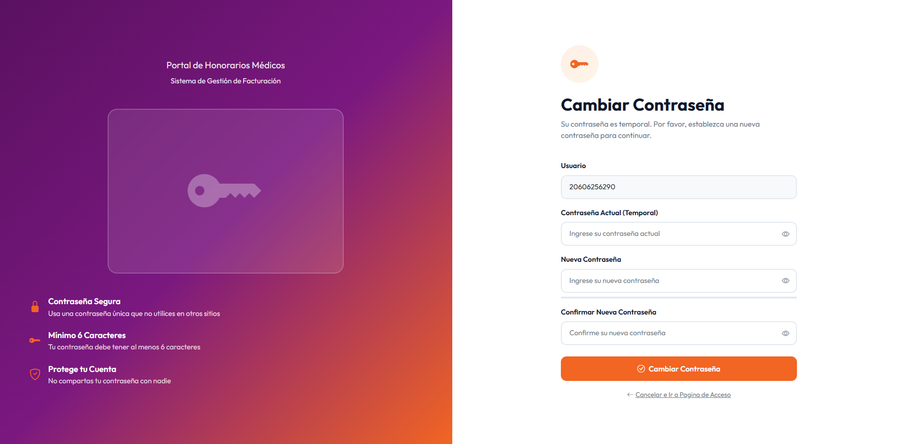

*Figura 2.2: Pantalla de cambio de contraseña temporal*

### 2.5 Recuperar Contraseña Olvidada

1. En la pantalla de login, haga clic en **"¿Olvidaste tu contraseña?"**
2. Ingrese su usuario o correo electrónico registrado
3. Presione **"Enviar Instrucciones"**
4. Recibirá un correo con un enlace de recuperación (válido por tiempo limitado)
5. Haga clic en el enlace del correo y siga las instrucciones para establecer una nueva contraseña

*Figura 2.3: Pantalla de recuperación de contraseña*

> **Importante:** Si no recibe el correo en unos minutos, revise la carpeta de spam. Si el problema persiste, contacte al administrador.

---

## 3. Dashboard

El Dashboard es la pantalla principal y muestra un resumen de la actividad de su compañía médica.

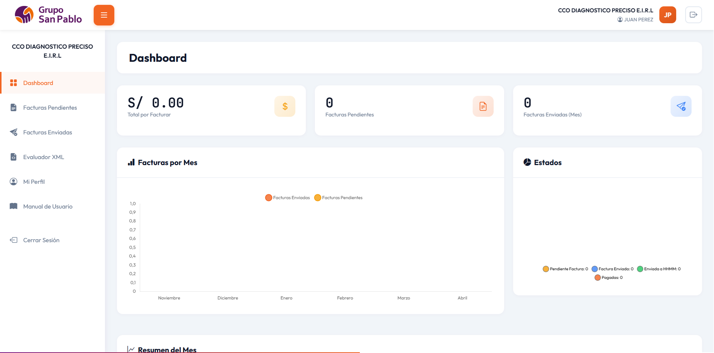

*Figura 3.1: Vista general del Dashboard*

### 3.1 Tarjetas de Estadísticas

En la parte superior encontrará tres tarjetas con información clave:

| Tarjeta | Descripción |
|---------|-------------|
| **Total por Facturar** | Suma en soles (S/) de todas las facturas pendientes de envío |
| **Facturas Pendientes** | Cantidad de facturas que aún no han sido enviadas |
| **Facturas Enviadas (Mes)** | Cantidad de facturas enviadas durante el mes actual |

### 3.2 Gráficos

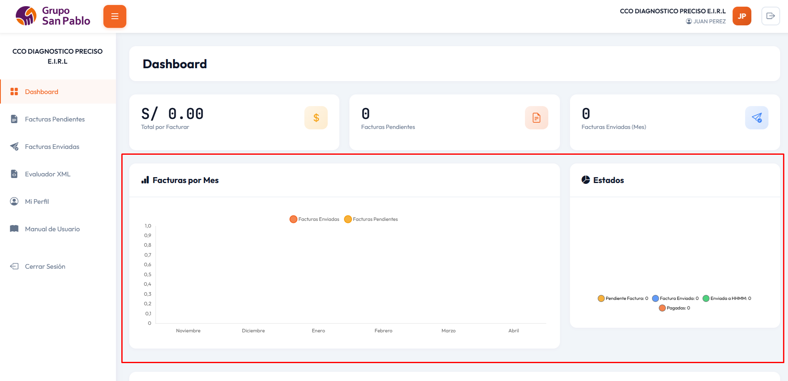

*Figura 3.2: Gráficos de facturas por mes y estados*

**Gráfico de Barras – Facturas por Mes**
Muestra la evolución de los últimos 6 meses, con barras diferenciadas para:
- Facturas enviadas
- Facturas pendientes

**Gráfico Circular – Estados Actuales**
Distribución porcentual de todos los comprobantes por estado:
- Pendiente de factura
- Factura enviada
- Factura enviada a HHMM
- Pagado

### 3.3 Resumen del Mes

Sección inferior con información detallada del mes en curso:

| Indicador | Descripción |
|-----------|-------------|
| **Total Facturado (S/)** | Suma de importes de facturas procesadas en el mes |
| **Facturas Procesadas** | Cantidad de facturas completadas |
| **Tiempo Promedio** | Días promedio desde producción hasta envío |

---

## 4. Facturas Pendientes

Listado de facturas que el sistema ha generado para su compañía y que aún no han sido enviadas.

### 4.1 Acceso

En el menú lateral, seleccione **Facturas → Pendientes**.

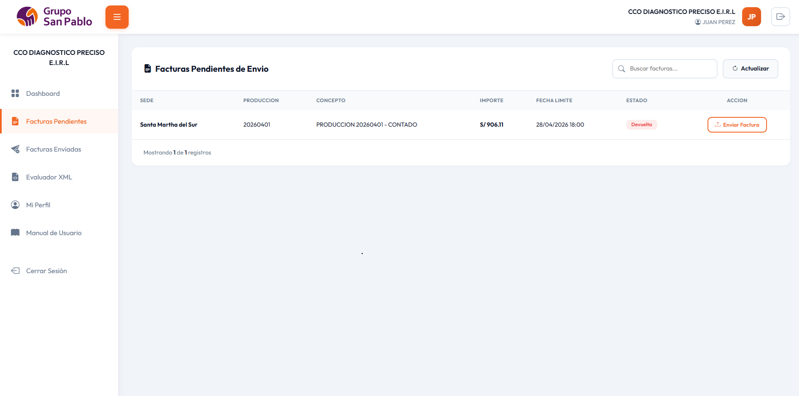

*Figura 4.1: Lista de facturas pendientes de envío*

### 4.2 Información de la Tabla

| Columna | Descripción |
|---------|-------------|
| **Producción** | Código y número de producción |
| **Sede** | Nombre de la sede o clínica |
| **Concepto** | Descripción del servicio facturado |
| **Importe** | Monto total a facturar (S/) |
| **Fecha Límite** | Fecha máxima para enviar el comprobante |
| **Acciones** | Botones: Ver datos / Subir factura |

### 4.3 Ver Datos de Producción

El botón **"Ver Datos"** abre un panel informativo con los detalles completos de la producción:
- Datos del emisor (RUC, razón social)
- Datos del receptor (RUC, nombre)
- Desglose de importes (subtotal, IGV, retención, total)
- Concepto descriptivo

*Figura 4.2: Panel de datos de producción*

También dispone de un botón de **copiar concepto** para facilitar la escritura del XML.

### 4.4 Búsqueda en Tiempo Real

Use el campo de búsqueda para filtrar por código de producción, sede o concepto. La lista se actualiza automáticamente mientras escribe (sin necesidad de presionar Enter).

### 4.5 Actualizar Lista

Presione **"Actualizar"** para recargar la lista y ver si hay nuevas facturas disponibles.

---

## 5. Subir Factura (Asistente de 4 pasos)

Este asistente guiado le permite enviar un comprobante electrónico de forma ordenada, validando cada paso antes de continuar.

### 5.1 Iniciar el Proceso

1. Vaya a **Facturas → Pendientes**
2. Ubique la factura que desea enviar
3. Haga clic en el botón **"Subir Factura"** (ícono de carga)

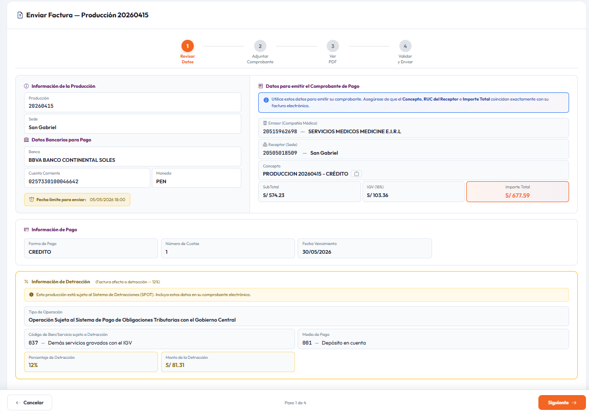

*Figura 5.1: Indicador de progreso del asistente de 4 pasos*

---

### Paso 1 – Revisión de Datos de Producción

Este paso es **informativo y de solo lectura**. El sistema presenta los datos registrados en la plataforma HHMM que debe respetar al emitir el comprobante.

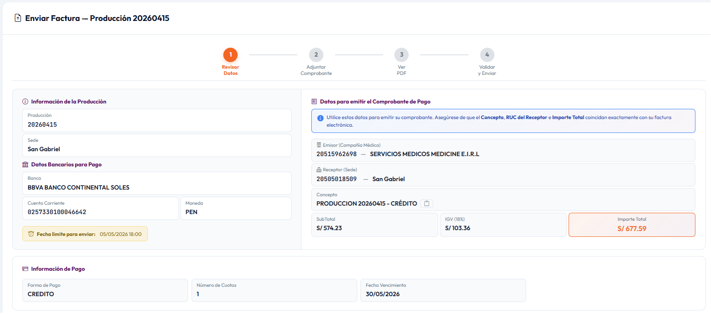

*Figura 5.2: Paso 1 – Datos de producción (solo lectura)*

**Información mostrada:**

| Sección | Campos |
|---------|--------|
| **Producción** | Código, número, sede, periodo |
| **Emisor** | RUC y razón social de su compañía médica |
| **Receptor** | RUC y nombre del receptor |
| **Concepto** | Descripción del servicio |
| **Importes** | Subtotal, IGV, retención, total a pagar |
| **Cuenta Bancaria** | Banco, cuenta corriente, CCI y moneda para el pago |

> **Importante:** Verifique que los datos de su factura electrónica coincidan exactamente con los mostrados en este paso. El sistema validará esta coincidencia automáticamente en el Paso 4.

Si su compañía no tiene cuenta bancaria registrada y el sistema lo requiere, aparecerá una advertencia y no podrá continuar. En ese caso, contacte al administrador.

Presione **"Siguiente →"** para avanzar.

---

### Paso 2 – Carga de Archivos

En este paso debe adjuntar los archivos de su comprobante electrónico.

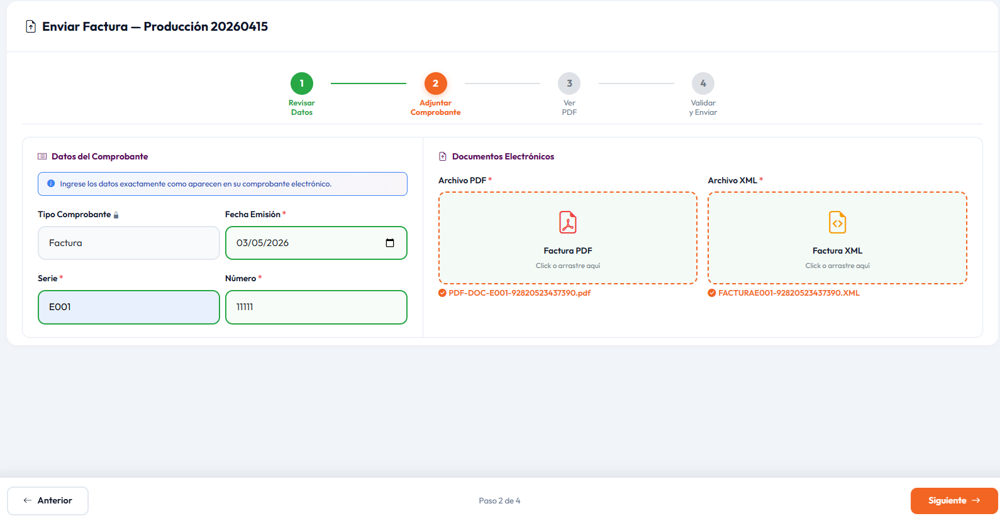

*Figura 5.3: Paso 2 – Zonas de carga de archivos*

**Archivos requeridos:**

| Archivo | Extensión | Obligatorio | Descripción |
|---------|-----------|-------------|-------------|
| **PDF** | .pdf | Sí | Representación impresa del comprobante (SUNAT) |
| **XML** | .xml | Sí | Archivo XML UBL 2.1 firmado digitalmente |
| **CDR** | .xml | Según configuración | Constancia de Recepción de SUNAT |

**Cómo adjuntar archivos:**

1. Haga clic sobre el área de carga (o arrastre el archivo hacia ella)
2. Seleccione el archivo desde su equipo
3. El nombre del archivo aparecerá en el área confirmando la carga
4. Repita el proceso para cada tipo de archivo

> Si carga un archivo incorrecto, haga clic en el ícono de eliminar (✕) junto al nombre del archivo y cargue el correcto.

Una vez cargados los archivos requeridos, presione **"Siguiente →"** para que el sistema procese el XML.

---

### Paso 3 – Vista Previa del XML

El sistema parsea y extrae automáticamente los datos del XML cargado y los presenta organizados para su revisión.

*Figura 5.4: Paso 3 – Vista previa de datos del XML*

**Secciones mostradas:**

#### Datos Generales del Comprobante
| Campo | Descripción |
|-------|-------------|
| Tipo Comprobante | Factura, Recibo por Honorarios, etc. |
| Serie | Serie del comprobante (ej. F001) |
| Número | Número correlativo |
| Fecha Emisión | Fecha del comprobante |
| Moneda | PEN (soles) u otra |

#### Participantes
- **Emisor:** RUC, razón social y dirección extraídos del XML
- **Receptor:** RUC y razón social del adquirente

#### Importes
Desglose completo: valor venta, IGV, ISC, otros cargos y total a pagar.

#### Información de Pago
- **Forma de pago:** Contado o Crédito
- Si es crédito, se muestran las cuotas con fecha y monto de cada una

#### Detracción (si aplica)

Si el XML incluye datos de detracción, se muestra un panel con:

*Figura 5.5: Panel de detracción en Paso 3*

| Campo | Descripción |
|-------|-------------|
| Código Medio de Pago | Código SUNAT del medio de pago |
| Número de Cuenta | Cuenta del Banco de la Nación |
| Código Bien/Servicio | Código SUNAT del bien o servicio sujeto a detracción |
| Porcentaje | Porcentaje de detracción aplicado |
| Monto | Importe detraído (S/) |

Revise que todos los datos mostrados correspondan a su comprobante. Presione **"Siguiente →"** para continuar.

---

### Paso 4 – Validación y Confirmación

El sistema compara los datos del XML con los datos registrados en la plataforma y presenta los resultados en una tabla de validación.

*Figura 5.6: Paso 4 – Tabla de validación sistema vs XML*

#### Tabla de Validación

La tabla tiene cuatro columnas:

| Columna | Descripción |
|---------|-------------|
| **Campo** | Dato que se está comparando |
| **Sistema / Esperado** | Valor registrado en la plataforma HHMM |
| **XML** | Valor encontrado en el XML cargado |
| **Estado** | Resultado de la comparación |

**Significado de los estados:**

| Ícono | Estado | Acción requerida |
|-------|--------|-----------------|
| ✅ Verde | Coincide | Ninguna |
| ⚠️ Naranja | Advertencia | Puede continuar, pero revise |
| ❌ Rojo | Error | Debe corregir antes de enviar |

#### Campos validados

**Datos del Comprobante:**
- Tipo de comprobante
- Serie y número
- Fecha de emisión
- Moneda
- Subtotal, IGV, total

**Participantes:**
- RUC del emisor
- RUC del receptor

**Detracción (si el parámetro de validación está activo):**
- Porcentaje de detracción
- Monto de detracción

#### Banner de Resumen

En la parte superior de la sección de validación aparece un resumen con el conteo de errores y advertencias encontrados:
- Si hay **errores (rojo)**: debe corregir el comprobante antes de continuar
- Si solo hay **advertencias (naranja)**: puede enviar, pero se recomienda revisar
- Si todo es **verde**: el comprobante está listo para enviar

#### Confirmar Envío

Una vez que no haya errores bloqueantes:

1. Revise el resumen de archivos cargados
2. Verifique los datos bancarios para el pago
3. Presione **"Confirmar Envío"**
4. Confirme la operación en el diálogo que aparece
5. El sistema registrará el comprobante y actualizará el estado de la factura

*Figura 5.7: Diálogo de confirmación de envío*

Recibirá un mensaje de **éxito** y podrá ver el comprobante en la sección **Facturas Enviadas**.

*Figura 5.8: Mensaje de envío exitoso*

---

## 6. Facturas Enviadas

Historial completo de todos los comprobantes enviados por su compañía médica.

### 6.1 Acceso

En el menú lateral, seleccione **Facturas → Enviadas**.

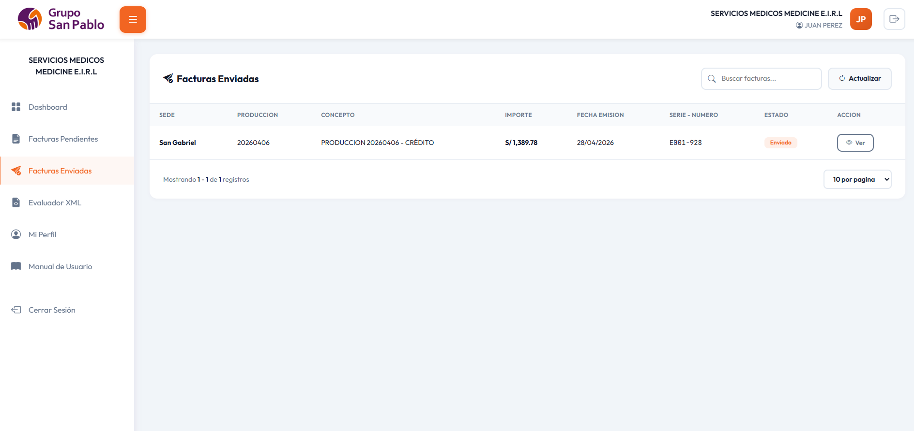

*Figura 6.1: Lista de facturas enviadas*

### 6.2 Información de la Tabla

| Columna | Descripción |
|---------|-------------|
| **Producción** | Código y número |
| **Sede** | Nombre de la sede |
| **Concepto** | Descripción del servicio |
| **Importe** | Total facturado (S/) |
| **Fecha Emisión** | Fecha del comprobante |
| **Serie – Número** | Identificador único del comprobante |
| **Estado** | Estado actual en el proceso |
| **Acciones** | Botón para ver el detalle |

### 6.3 Estados del Comprobante

| Estado | Color | Descripción |
|--------|-------|-------------|
| **Enviado** | Azul | Comprobante recibido, pendiente de revisión por HHMM |
| **Enviado HHMM** | Celeste | Registrado en el sistema HHMM |
| **Aprobado** | Verde | Validado correctamente |
| **Observado** | Rojo | Tiene observaciones; contacte al administrador |
| **Pagado** | Verde oscuro | Proceso completado y pago realizado |

### 6.4 Búsqueda y Paginación

- Use el campo de búsqueda para filtrar por serie, número, sede o concepto
- Navegue entre páginas con los botones **Anterior / Siguiente** o haciendo clic en el número de página
- Cambie la cantidad de registros por página (10, 25, 50) con el selector correspondiente

---

## 7. Detalle de Factura

Vista completa de un comprobante enviado.

### 7.1 Acceso

1. Vaya a **Facturas → Enviadas**
2. Haga clic en el botón **"Ver Detalle"** de la fila correspondiente

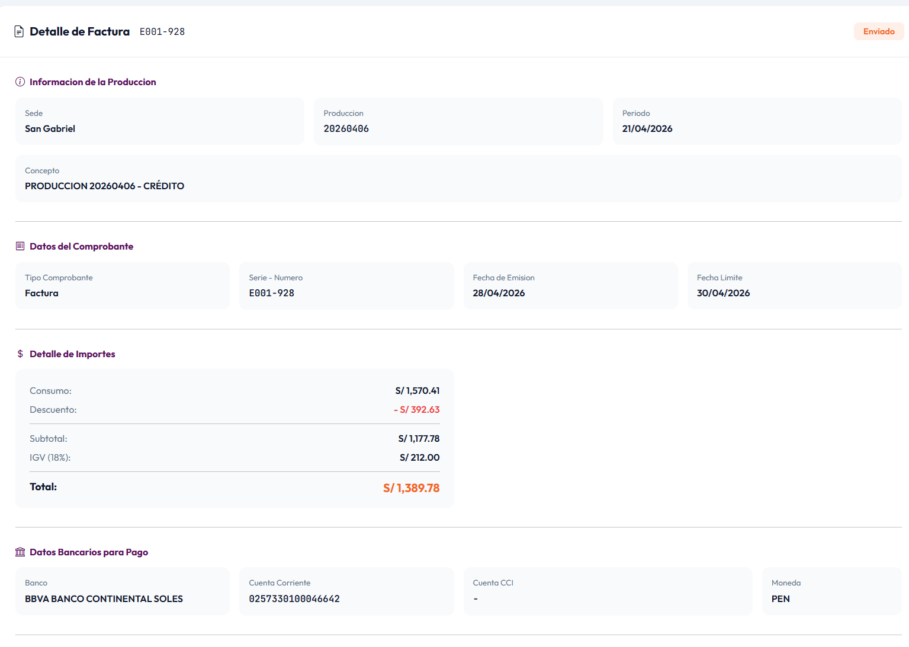

*Figura 7.1: Vista de detalle de factura*

### 7.2 Secciones del Detalle

#### Encabezado
Muestra el estado actual del comprobante en un badge de color.

#### Información de Producción
- Sede, código, número, periodo, concepto

#### Datos del Comprobante
- Tipo, serie, número, fecha de emisión, moneda

#### Emisor y Receptor
- RUC y razón social de ambas partes

#### Importes
| Concepto | Valor |
|----------|-------|
| Consumo | Importe del servicio médico |
| Descuento | Descuento aplicado (si aplica) |
| Subtotal | Base imponible |
| IGV | 18% del subtotal |
| Retención | Retención (si aplica) |
| **Total** | **Monto final a pagar** |

#### Datos Bancarios
Cuenta donde se realizará el abono del pago.

#### Archivos Adjuntos

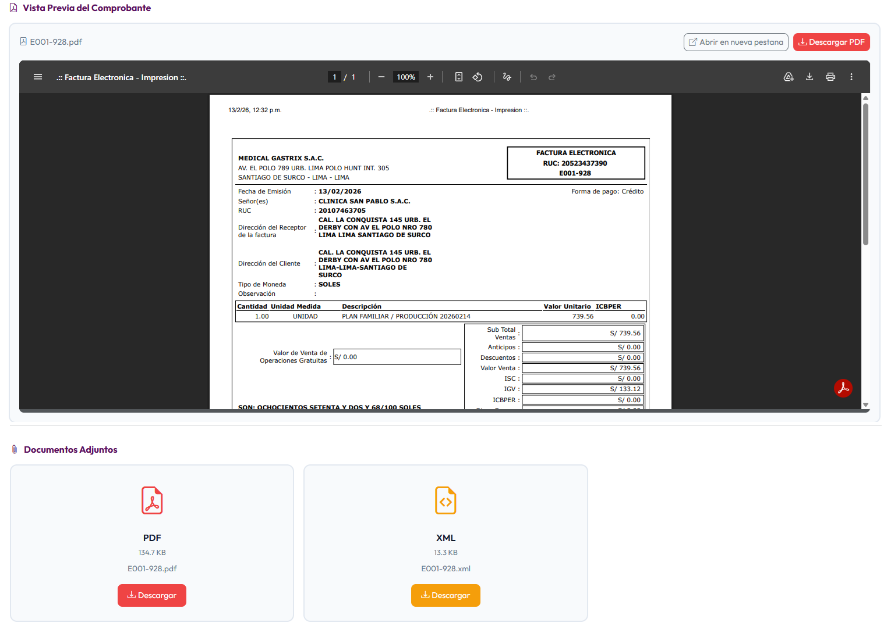

*Figura 7.2: Archivos adjuntos descargables*

| Tipo | Descripción | Acción |
|------|-------------|--------|
| PDF | Representación impresa | Descargar |
| XML | Comprobante electrónico | Descargar |
| CDR | Constancia de recepción SUNAT | Descargar |

Haga clic en el botón de descarga junto a cada archivo para obtenerlo.

#### Bitácora de Acciones

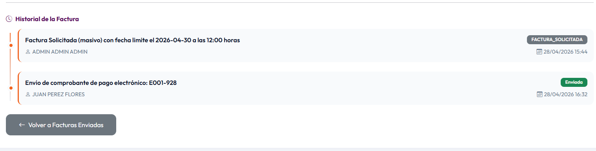

*Figura 7.3: Bitácora de eventos del comprobante*

Registro cronológico de todos los eventos del comprobante:
- Fecha y hora
- Usuario que realizó la acción
- Descripción del evento (carga de archivos, validaciones, cambios de estado)

---

## 8. Mi Perfil

Gestión de información personal y seguridad de su cuenta.

### 8.1 Acceso

En el menú lateral, seleccione el ícono de usuario o su nombre, luego **"Mi Perfil"**.

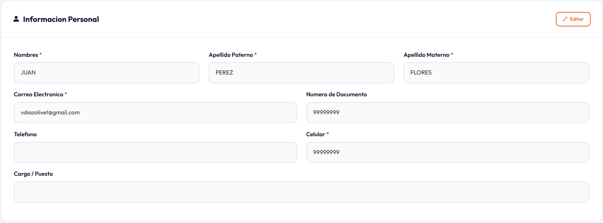

*Figura 8.1: Pantalla de Mi Perfil*

### 8.2 Información Personal

Datos que puede **visualizar y editar**:

| Campo | Descripción |
|-------|-------------|
| Nombres | Nombre(s) del usuario |
| Apellido Paterno | Primer apellido |
| Apellido Materno | Segundo apellido |
| Correo Electrónico | Dirección de correo de contacto |
| Número de Documento | DNI o RUC personal |
| Teléfono | Número fijo |
| Celular | Número de celular |
| Cargo / Puesto | Puesto en la compañía médica |

**Para editar:**
1. Haga clic en **"Editar"**
2. Modifique los campos deseados
3. Presione **"Guardar Cambios"**
4. Aparecerá una confirmación de que los datos fueron actualizados

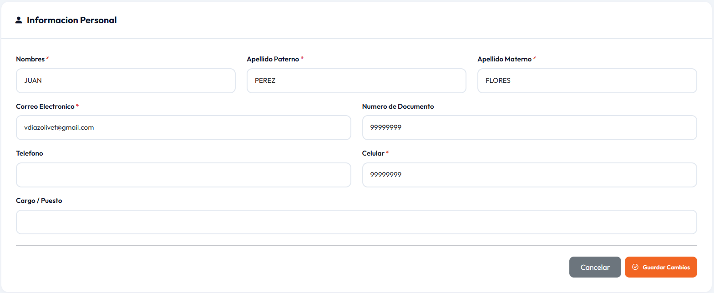

*Figura 8.2: Modo de edición de información personal*

### 8.3 Información de la Entidad Médica

Datos de su compañía médica registrados en el sistema (**solo lectura**):
- Código, RUC, Razón Social
- Dirección, Teléfono, Celular

> Para modificar estos datos, contacte al administrador del sistema.

### 8.4 Cuentas Bancarias

Lista de cuentas bancarias registradas para recibir pagos (**solo lectura**):

| Campo | Descripción |
|-------|-------------|
| Banco | Nombre de la entidad financiera |
| Moneda | PEN (soles) o USD (dólares) |
| Cuenta Corriente | Número de cuenta corriente |
| Cuenta CCI | Código de Cuenta Interbancario |

> Para agregar, modificar o eliminar cuentas bancarias, contacte al administrador.

### 8.5 Cambiar Contraseña

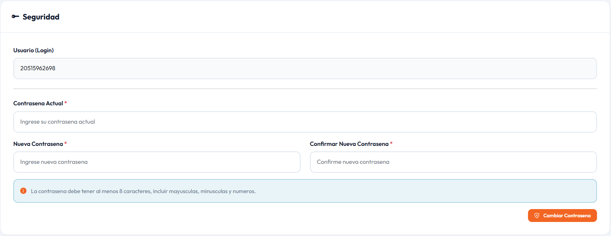

*Figura 8.3: Sección de cambio de contraseña*

1. Ingrese su **contraseña actual**
2. Ingrese la **nueva contraseña** (mínimo 8 caracteres)
3. **Confirme** la nueva contraseña
4. Presione **"Cambiar Contraseña"**

**Requisitos de la contraseña:**
- Mínimo 8 caracteres
- Se recomienda combinar letras mayúsculas, minúsculas, números y caracteres especiales

---

## 9. Herramientas – Evaluador de XML

Esta herramienta permite validar la estructura de un archivo XML antes de enviarlo como factura, sin necesidad de pasar por el proceso completo de carga.

### 9.1 Acceso

En el menú lateral, seleccione **Evaluador XML**.

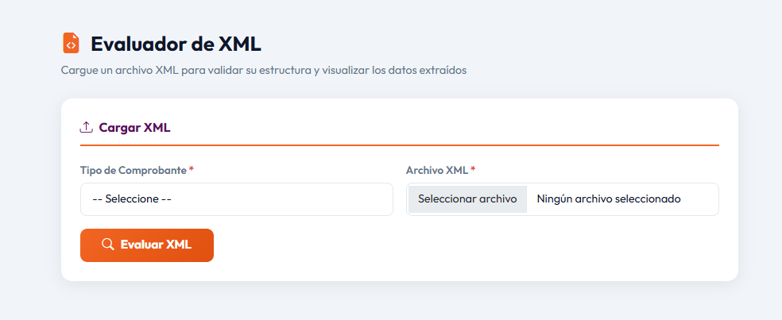

*Figura 9.1: Pantalla del Evaluador de XML*

### 9.2 Cómo Usar el Evaluador

1. **Cargar el archivo XML:**
   - Haga clic en el área de carga o arrastre su archivo `.xml` hacia ella
   - El nombre del archivo aparecerá confirmando la carga

2. **Evaluar:**
   - Presione el botón **"Evaluar"**
   - El sistema analizará la estructura del XML automáticamente

3. **Revisar Resultados:**
   - Si el XML es válido, verá un indicador **verde** de éxito
   - Si el XML tiene errores, verá un indicador **rojo** con el mensaje del problema

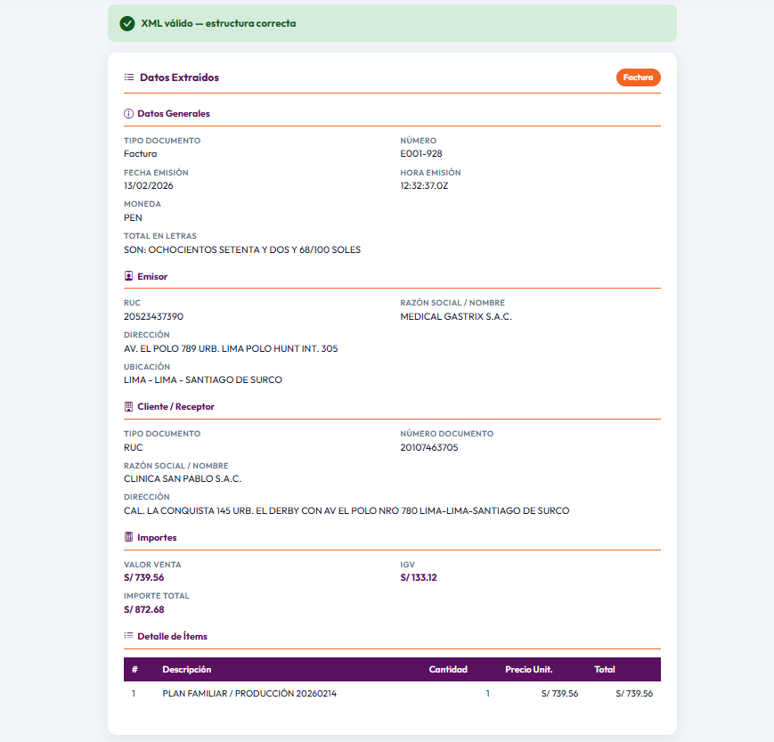

*Figura 9.2: Resultados de la evaluación del XML*

### 9.3 Datos Extraídos

Si el XML es válido, el sistema mostrará los datos extraídos organizados en secciones:

| Sección | Datos mostrados |
|---------|-----------------|
| **Datos Generales** | Tipo, número, fecha de emisión, moneda |
| **Emisor** | RUC, razón social, dirección |
| **Cliente / Receptor** | Tipo de documento, número, razón social |
| **Totales** | Valor venta, IGV, retención, total |
| **Detalle de Ítems** | Tabla con descripción, cantidad, precio unitario y total por ítem |

### 9.4 Uso Recomendado

Utilice el Evaluador de XML en estos casos:
- Antes de enviar una factura por primera vez con un nuevo emisor de comprobantes
- Para verificar que el XML tiene la estructura UBL 2.1 correcta
- Para revisar si los datos del XML coinciden con los esperados por el sistema
- Para diagnosticar errores en el Paso 4 del asistente de envío

> **Nota:** El Evaluador solo valida la estructura y extrae datos. No registra ningún comprobante ni afecta el estado de sus facturas.

---

## 10. Cerrar Sesión

### 10.1 Cómo Cerrar Sesión

**Opción 1 – Menú de usuario:**
1. Haga clic en su nombre o avatar en la esquina superior derecha
2. Seleccione **"Cerrar Sesión"**

**Opción 2 – Menú lateral:**
1. Desplácese hasta el final del menú lateral
2. Haga clic en **"Cerrar Sesión"**

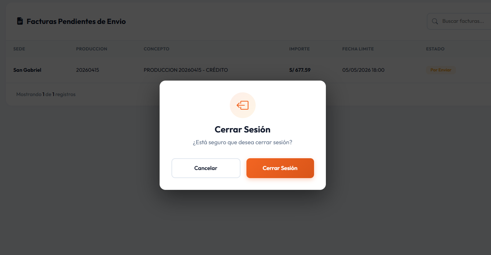

*Figura 10.1: Diálogo de confirmación de cierre de sesión*

### 10.2 Confirmación

1. Aparecerá un mensaje de confirmación
2. Presione **"Cerrar Sesión"** para confirmar
3. Será redirigido a la pantalla de inicio de sesión

### 10.3 Expiración Automática de Sesión

La sesión expira automáticamente después de **30 minutos de inactividad**. Si intenta realizar una acción con la sesión expirada:
- Las operaciones AJAX mostrarán una alerta indicando que la sesión expiró
- Las acciones de página completa lo redirigirán al login

> **Importante:** Siempre cierre sesión al terminar, especialmente en equipos compartidos.

---

## 11. Preguntas Frecuentes

**¿Por qué no puedo subir una factura si tengo todo preparado?**
Verifique que:
- Su compañía médica tenga cuenta bancaria registrada (si el sistema lo requiere)
- Los archivos PDF y XML sean válidos y estén firmados digitalmente
- Los datos del XML coincidan con los del sistema (use el Evaluador de XML para verificar)

**¿Qué hago si el Paso 4 muestra errores en rojo?**
Los errores en rojo indican que hay datos del XML que no coinciden con los registrados en el sistema. Corrija el comprobante electrónico (desde su emisor de facturas electrónicas) y cargue el XML corregido nuevamente desde el Paso 2.

**¿Qué diferencia hay entre un error (rojo) y una advertencia (naranja) en la validación?**
- **Error (rojo):** El sistema bloquea el envío hasta que se corrija. El dato es crítico (RUC, importe total, etc.)
- **Advertencia (naranja):** El sistema permite continuar, pero hay una diferencia que debería revisar. Puede indicar un campo no obligatorio o un parámetro de validación con menor prioridad.

**¿Puedo corregir una factura ya enviada?**
No. Una vez enviado el comprobante, no puede modificarse desde el portal. Contacte al administrador del sistema si necesita realizar una corrección.

**¿El CDR es obligatorio?**
Depende de la configuración del sistema. Si el administrador habilitó la validación de CDR, el campo será obligatorio. De lo contrario, es opcional.

**¿Qué hago si el sistema me indica "Usuario inactivo" al iniciar sesión?**
Su cuenta fue desactivada por el administrador. Comuníquese con el administrador del sistema para que reactive su acceso.

**¿Cómo sé si mi factura fue recibida correctamente?**
Después de confirmar el envío, la factura pasará al estado **"Enviado"** en la sección Facturas Enviadas. El sistema registrará la hora exacta del envío en la bitácora del comprobante.

**¿Puedo usar el Evaluador de XML con facturas que no son mías?**
Sí, el Evaluador solo lee y valida la estructura del archivo. No requiere que el XML sea de su compañía y no registra ningún dato en el sistema.

---

## 12. Mensajes del Sistema

*Figura 12.1: Tipos de mensajes del sistema*

### Mensaje de Éxito (verde)
Indica que la operación se realizó correctamente. Aparece en la parte superior de la pantalla y desaparece automáticamente.

### Mensaje de Error (rojo)
Indica que ocurrió un problema. Lea el mensaje para entender la causa. Si el error persiste, contacte al soporte técnico con el mensaje exacto.

### Mensaje de Advertencia (naranja/amarillo)
Indica una situación que requiere atención pero no impide continuar.

### Alerta de Confirmación
Aparece antes de operaciones críticas (enviar factura, cerrar sesión). Presione **"Confirmar"** para proceder o **"Cancelar"** para volver atrás.

### Alerta de Sesión Expirada
Si ve el mensaje "Su sesión ha expirado", haga clic en el botón de redirigir al login para volver a iniciar sesión. Los datos no guardados se perderán.

---

## 13. Soporte Técnico

Para asistencia técnica o reportar problemas en el sistema, contacte al equipo de soporte:

- **Email:** soporte@gruposanpablo.com.pe
- **Teléfono:** (01) 123-4567
- **Horario de atención:** Lunes a Viernes de 8:00 a.m. a 6:00 p.m.

Al contactar soporte, tenga a mano:
- Nombre de usuario
- Módulo donde ocurrió el problema
- Descripción del error o mensaje que apareció en pantalla
- Hora aproximada en que ocurrió

---

*Documento elaborado por el equipo de desarrollo ADG – Sistema SHM*
*Versión 2.0 – Abril 2026*
